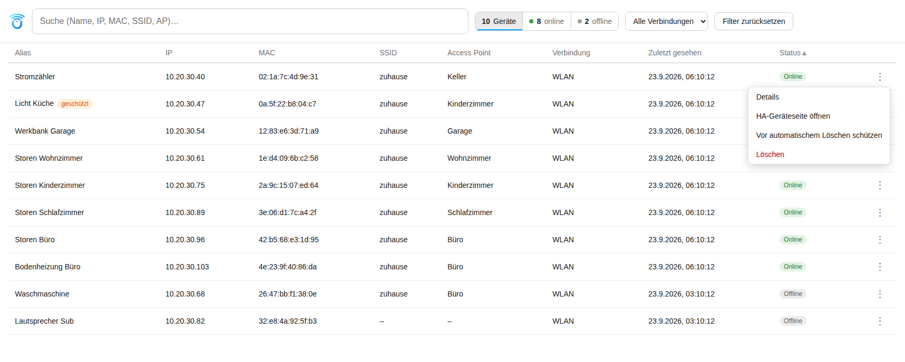
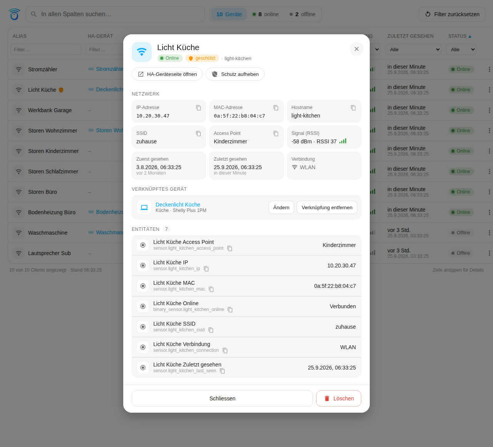

# UniFi Dynamic Clients

[English](README.md) · **Deutsch**

Home-Assistant-Integration, die pro UniFi-Client (verkabelt oder WLAN)
automatisch ein Gerät mit den passenden Entitäten anlegt und wieder entfernt,
sobald der Client vom UniFi-Controller länger nicht mehr gemeldet wird.

## Funktionen

- Legt pro Client ein Gerät mit Sensoren an: IP, MAC, SSID, Access Point,
  Verbindungsart und „Last seen" sowie einen Binary-Sensor „Online".
- Persistenter Client-Cache: Werte offline gegangener Clients bleiben nach
  Neustart, Reload und Options-Änderung erhalten.
- Automatisches, konfigurierbares Entfernen („Purge") nach X Tagen ohne
  Sichtung, inklusive täglichem Lauf zu einer einstellbaren Uhrzeit.
- Einzelne Geräte lassen sich vom automatischen Entfernen ausnehmen.
- Aktion `unifi_dynamic.remove_client` zum gezielten Entfernen einzelner
  Clients, per Geräteauswahl oder MAC-Adresse.
- Aktion `unifi_dynamic.purge_now` zum manuellen Auslösen, wahlweise als
  Testlauf („dry run") ohne Löschen.
- Push-Benachrichtigung bei neu erkannten Clients, mit einzeln schaltbarem
  Inhalt (Anzeigename, Verbindungsart, SSID, Access Point, IP, MAC).
- Alle Push- und anhaltenden Benachrichtigungen sind zweisprachig: Deutsch
  oder Englisch, automatisch anhand der konfigurierten Sprache der
  Home-Assistant-Instanz gewählt (Englisch als Fallback für jede andere
  Sprache).
- Das Bild der Meldung bringt die Integration mit, nichts einzurichten.
- Die Neugeräte-Meldung wartet, bis alle gewählten Angaben tatsächlich
  vorliegen, und sendet dann sofort. Ein Tipp darauf öffnet die
  Geräteansicht des Clients im Panel, wahlweise seine Home-Assistant-Geräteseite. Zwei Buttons wirken direkt aus der Meldung heraus: „Nie
  entfernen" setzt den Client auf die Ausnahmeliste, „Jetzt entfernen" löscht
  ihn sofort.
- Der Purge setzt aus, solange der Controller nicht erreichbar ist. Ein Ausfall
  kann den Bestand damit nie löschen. Ein ausgesetzter Lauf wird gemeldet.
- Die Erreichbarkeit des Controllers bemisst sich an fehlgeschlagenen Abfragen
  in Folge, die Schwelle ist einstellbar. Gemeldet wird je Störung einmal, die
  Entwarnung kommt mit der ersten wieder erfolgreichen Abfrage. Push und
  anhaltende Benachrichtigung sind getrennt abschaltbar.
- Anhaltende Benachrichtigung in der Seitenleiste mit dem Bericht des letzten
  Purge-Laufs, getrennt schaltbar von der Push-Meldung.
- SSID- und Access-Point-Sensoren nur für Clients, die je im WLAN gesehen
  wurden. Reine Kabel-Clients bekommen sie nicht.
- Ein in der Seitenleiste angeheftetes Panel zeigt eine durchsuch- und
  filterbare Tabelle aller Clients über alle konfigurierten UniFi-Hosts
  hinweg (Alias, verknüpftes HA-Gerät, IP, MAC, SSID, Access Point, Verbindungsart, zuletzt
  gesehen, Online-Status), mit Menü pro Zeile zum Entfernen oder Eintragen
  in die Ausnahmeliste. Ein Tipp auf eine Zeile öffnet eine Geräteansicht mit
  allen Angaben, den Entitäten und denselben Aktionen.

## Installation

### Über HACS (Custom Repository)

1. HACS öffnen → Drei-Punkte-Menü (oben rechts) → **Custom repositories**.
2. Repository-URL `https://github.com/Diegofuego871/unifi_dynamic` eintragen,
   Kategorie **Integration** wählen.
3. „UniFi Dynamic Clients" in HACS suchen und installieren.
4. Home Assistant neu starten.

### Manuell

1. Ordner `custom_components/unifi_dynamic` aus diesem Repository in das
   `custom_components`-Verzeichnis der Home-Assistant-Konfiguration kopieren.
2. Home Assistant neu starten.

## Einrichtung

**Einstellungen → Geräte & Dienste → Integration hinzufügen → „UniFi Dynamic
Clients"**.

| Feld | Beschreibung |
| --- | --- |
| Host oder IP | Adresse des UniFi-Controllers, ohne `https://` |
| API-Key | API-Schlüssel des UniFi-Controllers |
| SSL-Zertifikat prüfen | Deaktivieren bei selbstsigniertem Zertifikat |
| Abfrageintervall | Wie oft die Clientliste abgefragt wird (Sekunden) |
| Entfernen nach Tagen ohne Sichtung | 0 deaktiviert das automatische Entfernen |

## Optionen

Nachträglich über **Konfigurieren** an der Integration erreichbar. Der Dialog
ist in vier Abschnitte gegliedert, die beim Öffnen zugeklappt sind.

### Abfrage

| Option | Bedeutung | Vorgabe |
| --- | --- | --- |
| Abfrageintervall | Wie oft die Clientliste vom Controller geholt wird | 30 s |
| Als ausgefallen nach (Abfragen) | Fehlgeschlagene Abfragen in Folge, bis der Controller als ausgefallen gilt | 30 |

### Automatisches Entfernen

| Option | Bedeutung | Vorgabe |
| --- | --- | --- |
| Entfernen nach Tagen ohne Sichtung | Schwelle in Tagen, 0 deaktiviert das Entfernen | 30 |
| Uhrzeit des täglichen Laufs | Lokale Zeit des Aufräumlaufs | 19:00 |
| Geräte vom Entfernen ausnehmen | Mehrfachauswahl; ausgewählte Clients werden nie automatisch entfernt | leer |

### Push-Benachrichtigung

| Option | Bedeutung | Vorgabe |
| --- | --- | --- |
| Ziel für Push-Benachrichtigung | notify-Service oder notify-Entity, etwa eine notify-Gruppe | keines |
| Tipp auf eine Gerätemeldung öffnet | „Geräteansicht im Panel" oder „Home-Assistant-Geräteseite" (für alle, die das Panel nicht nutzen) | Geräteansicht im Panel |
| Auch melden, wenn nichts entfernt wurde | Push nach jedem täglichen Lauf, auch ohne Treffer | aus |
| Neue Geräte melden | Push, sobald ein Client zum ersten Mal auftaucht | an |
| Melden, wenn der Controller ausfällt | Push nach einer Stunde ohne erfolgreichen Poll, samt Entwarnung | an |
| Inhalt: … | Sechs Schalter für Anzeigename, Verbindungsart, SSID, Access Point, IP und MAC | alle an ausser MAC |

### Anhaltende Benachrichtigung

| Option | Bedeutung | Vorgabe |
| --- | --- | --- |
| Anhaltende Benachrichtigung erstellen | Bericht des Aufräumlaufs in der Seitenleiste | an |
| Auch erstellen, wenn nichts entfernt wurde | Andernfalls erscheint sie nur bei tatsächlichen Treffern | an |
| Auch erstellen, wenn der Controller ausfällt | Bleibt in der Seitenleiste, bis der Controller wieder antwortet | an |

## Aktion `unifi_dynamic.purge_now`

Löst den Aufräumlauf sofort aus, statt auf die eingestellte Uhrzeit zu warten.

| Feld | Pflicht | Beschreibung |
| --- | --- | --- |
| `dry_run` | Nein | Nur ermitteln, was entfernt würde. Es wird nichts gelöscht. |
| `entry_id` | Nein | Ohne Angabe laufen alle eingerichteten UniFi-Hosts. |

Die Aktion liefert eine strukturierte Antwort mit Anzahl entfernter Clients,
Entitäten und Geräte sowie der Anzahl ausgenommener Clients.

## Aktion `unifi_dynamic.remove_client`

Entfernt einzelne Clients sofort, unabhängig von der Schwelle und von der
Ausnahmeliste.

| Feld | Pflicht | Beschreibung |
| --- | --- | --- |
| `device_id` | Eines von beiden | Zu entfernende Geräte, Mehrfachauswahl möglich. |
| `mac` | Eines von beiden | MAC-Adressen, mehrere möglich. Doppelpunkte, Bindestriche, Punkte oder blanke Hexfolge. |
| `entry_id` | Nein | Nur für MAC-Adressen relevant. Ohne Angabe werden alle eingerichteten UniFi-Hosts durchsucht. |

Die Antwort nennt je Client den Entry, die MAC, den Namen, die Zahl entfernter
Entitäten und Geräte sowie ob er zu diesem Zeitpunkt online war — dann legt ihn
der nächste Abgleich wieder an, mit neuen Entity-IDs. Unbekannte Adressen
kommen mit `removed: false` zurück, statt den Aufruf scheitern zu lassen. Ein
noch aktiver Client taucht beim nächsten Abgleich wieder auf und wird erneut
als neu gemeldet - aus Sicht des Caches ist er das auch. Eine Bestätigungs-Push
gibt es nicht, die Antwort ist die Rückmeldung.

## Panel

Ein Panel namens „UniFi Dynamic Clients" ist in der Seitenleiste angeheftet
(nur für Administratoren sichtbar). Es zeigt eine Tabelle mit allen Clients
über alle konfigurierten UniFi-Hosts hinweg — Alias, IP, MAC, SSID, Access
Point, Verbindungsart, zuletzt gesehen und ein Online/Offline-Badge —, die
sich aktualisiert, indem sie alle 10 Sekunden nachfragt, solange das Panel
offen ist. Die Suchleiste oben durchsucht alle diese Felder gleichzeitig,
mit einem „×"-Button, der erscheint, sobald Text drinsteht, und ihn mit
einem Klick leert. Daneben zählt eine Statusleiste alle Geräte und wie viele
davon online und offline sind — „40 Geräte · ● 34 online · ○ 6 offline" —
über alle Hosts hinweg. Die Zahlen folgen dem Kabel/WLAN-Filter, beschreiben
also immer die Gruppe, die man gerade anschaut – nicht aber der Suche oder
der Online/Offline-Auswahl selbst (sonst stünde bei „online" 0, während man
die Offline-Geräte ansieht). Sie
dient zugleich als Online/Offline-Filter: ein Tipp auf „online" oder
„offline" zeigt nur diese Geräte, ein erneuter Tipp auf den aktiven Teil
wieder alle, und der aktive Teil ist hervorgehoben. Ein Dropdown filtert
nach Kabel/WLAN. Ein Klick auf eine Spaltenüberschrift sortiert die Tabelle
aufsteigend danach;
ein erneuter Klick auf dieselbe Überschrift dreht auf absteigend um, ein
Klick auf eine andere Überschrift wechselt die Sortierspalte. Ein kleiner
Pfeil markiert die aktive Spalte und Richtung. Zeilen ohne Wert in der
sortierten Spalte (keine IP, nie gesehen) landen immer am Ende, unabhängig
von der Richtung.

Suchtext, beide Filter sowie Sortierspalte und -richtung werden im
`localStorage` des Browsers gemerkt und überstehen ein Neuladen der Seite
oder sogar einen kompletten Home-Assistant-Neustart — `localStorage` hat
mit dem HA-Prozess nichts zu tun, bleibt also in beiden Fällen unberührt.
Das gilt pro Browser/Gerät, nicht geräteübergreifend synchronisiert. Ein
Button „Filter zurücksetzen" in der Werkzeugleiste setzt alles mit einem
Klick auf die Standardansicht zurück.

Jede Zeile hat ein ⋮-Menü mit „Details", „Vor automatischem Löschen schützen" (trägt
den Client in die Ausnahmeliste ein), „Löschen" (fragt zuerst nach, entfernt
dann sofort — dasselbe Verhalten wie der Meldungs-Button und die Aktion
`remove_client`: ein noch aktiver Client wird beim nächsten Abgleich neu
angelegt und erneut als neu gemeldet) und „HA-Geräteseite öffnen". Steht ein
Client schon auf der Ausnahmeliste, zeigt das Menü stattdessen „Nicht mehr
schützen", um ihn wieder davon zu entfernen. Der erste Menüpunkt,
„Details", öffnet die Geräteansicht — ebenso ein Tipp auf die Zeile selbst.

Die Geräteansicht ist ein Dialog über der Tabelle (auf dem Handy ein Blatt,
das von unten hereinfährt) mit allem, was die Integration über den Client
weiss: Status, Schutz, Verbindungsart, IP, MAC, Hostname, SSID, Access
Point, Signal (dBm und der RSSI-Wert des Controllers, bei einem Offline-Client
als „zuletzt gemessen" markiert), zuerst und zuletzt gesehen, jeweils mit
relativer Zeitangabe. Darunter stehen die Home-Assistant-Entitäten des
Clients mit ihrem aktuellen Zustand — ein Tipp darauf öffnet den
Entitäts-Dialog von Home Assistant mit Verlauf — und unten die Aktionen:
„HA-Geräteseite öffnen", schützen bzw. nicht mehr schützen und „Löschen".
Nach erfolgreichem Löschen schliesst sich der Dialog von selbst; schlägt eine
Aktion fehl, steht der Fehler im Dialog. Esc, der ×-Button oder ein Klick
neben den Dialog schliessen ihn. Kabel-Clients zeigen die WLAN-Felder nicht.

Jeder Client lässt sich mit einem beliebigen Home-Assistant-Gerät
verknüpfen — etwa dem Shelly- oder Sonos-Gerät hinter diesem Netzwerk-Client.
In der Geräteansicht öffnet „Gerät verknüpfen…" eine durchsuchbare Liste
aller Home-Assistant-Geräte (Name, Bereich, Hersteller); Geräte, die dieselbe
MAC-Adresse wie der Client melden, stehen als Vorschlag oben unter „Passt zur
MAC-Adresse". Danach zeigt die Ansicht das verknüpfte Gerät mit Bereich und
Modell, „Ändern" und „Verknüpfung entfernen", ein Klick auf den Namen öffnet
seine Geräteseite. Die Tabelle hat eine Spalte „HA-Gerät" mit dem Namen des
verknüpften Geräts, ein Klick führt direkt auf dessen Geräteseite; die Spalte
ist sortierbar, und die Suche findet Clients auch über Namen und Bereich des
verknüpften Geräts.

Die Verknüpfung speichert nur diese Integration; das verknüpfte Gerät selbst
wird nie verändert. Geräte dieser Integration und der offiziellen
UniFi-Network-Integration sind nicht verknüpfbar und erscheinen nicht in der
Liste: UniFi Network legt für dieselben Clients (und für Access Points und
Switches) eigene Geräte an, als Verknüpfungsziel wären sie nur eine Doppelung
des Clients. Ein Gerät, das sich UniFi Network mit einer anderen Integration
teilt, etwa einem Shelly, bleibt wählbar. Die Verknüpfung übersteht Neustarts und Updates. Wird der Client entfernt — von Hand oder
durch den Purge —, geht die Verknüpfung mit, und ein später neu angelegter
Client muss neu verknüpft werden; die Schutzfunktion bewahrt einen Client
(und damit seine Verknüpfung) vor dem Purge. Wird das verknüpfte Gerät in
Home Assistant gelöscht, fällt die Verknüpfung automatisch weg. Bewusst keine
Zusammenführung über die MAC-Adresse: Sie würde die Geräte dieser Integration
an Geräte anderer Integrationen binden, und das Entfernen eines Clients
könnte dann das fremde Gerät mitnehmen.

Neben IP, MAC, Hostname, SSID, Access Point und jeder Entity-ID steht ein
kleiner Kopieren-Button, der genau diesen Wert in die Zwischenablage legt —
bei einer Entität nur ihre ID, etwa `sensor.unifi_dynamic_…_connection`. Das
Symbol wird kurz zum Häkchen, und Home Assistant zeigt unten kurz „Kopiert:
…". Das Kopieren klappt auch, wenn Home Assistant über reines `http://`
erreichbar ist, wo Browser die Zwischenablage-Schnittstelle nicht anbieten:
Das Panel weicht dann auf den älteren Kopierbefehl des Browsers aus.

„Zuerst gesehen" stammt aus dem Feld `first_seen` des Controllers und reicht
damit auch vor die Installation zurück. Liefert der Controller es nicht,
nimmt die Integration den Zeitpunkt, zu dem sie den Client selbst zum ersten
Mal gesehen hat — ausser bei Clients, die bei Einrichtung oder Update schon
bekannt waren: Die zeigen „unbekannt" statt eines erfundenen Datums.

Ein Tipp auf die Zeile führte früher direkt auf die Geräteseite und damit
weg vom Panel, was beim Scrollen zu leicht passierte. Der Dialog ist dagegen
abgesichert: Eine Wischbewegung zählt ohnehin nie als Tipp, und auch ein Tipp
innerhalb von 300 ms nach dem Scrollen (der Tipp, der auf dem Handy eine
Schwungbewegung stoppt), ein Tipp bei offenem Zeilenmenü (schliesst nur das
Menü) und das Markieren von Text (etwa um eine MAC zu kopieren) öffnen ihn
nicht.

Push-Meldungen zu einem einzelnen Client verlinken auf
`/unifi-dynamic?entry=<Entry-ID>&mac=<MAC>`; das Panel öffnet die
Geräteansicht dieses Clients und entfernt die Parameter danach aus der
Adresse, damit ein Neuladen sie nicht erneut öffnet. Das funktioniert auch
bei bereits offenem Panel. Existiert der Client nicht mehr, erscheint ein
Hinweis. Wer das Panel nicht nutzt, stellt das Ziel in den Optionen („Tipp
auf eine Gerätemeldung öffnet", Abschnitt Push) auf die
Home-Assistant-Geräteseite zurück.

Bei mehr als einem konfigurierten UniFi-Host zeigt die Tabelle eine
Host-Spalte und listet die Clients aller Hosts gemeinsam, statt ein Panel
pro Host aufzuspalten.

Das Menü positioniert sich anhand der tatsächlichen Bildschirmposition des
Buttons und öffnet automatisch nach oben, wenn unten nicht genug Platz ist
— nötig, weil die Tabelle selbst scrollt, was das Menü bei Zeilen nahe dem
unteren Rand des sichtbaren Bereichs sonst abschneiden würde. Das Icon der
Integration erscheint am Anfang der Werkzeugleiste neben dem Suchfeld,
dasselbe Bild, das schon für Push-Meldungen ausgeliefert wird; scheitert
das Laden, blendet es sich selbst aus, statt ein kaputtes Bild-Icon zu
zeigen.

Die Kopfzeile über dem Panel — Titel und, auf einem schmalen Bildschirm wie
den iOS-/Android-Begleit-Apps, der Menü-Button zum Öffnen der Seitenleiste
samt Punkt für offene Mitteilungen — ist die von Home Assistant selbst,
dieselbe wie bei den eingebauten Panels. Darunter bleiben Suchfeld und
Filter stehen; nur die Tabelle scrollt, nach oben/unten und auf dem Handy,
wo nicht alle Spalten Platz haben, auch seitwärts. Die Spaltenüberschriften
bleiben beim Scrollen nach unten oben stehen und laufen beim seitlichen
Scrollen mit ihren Spalten mit.

Technisch ist das Panel als eines der eingebauten iframe-Panels von Home
Assistant registriert, das auf `panel/panel.html` in dieser Integration
zeigt — derselbe Ansatz wie z.B. bei Orphan Cleaner. Home Assistant zeichnet
die Kopfzeile um das iframe herum und gibt ihm eine feste Höhe, wodurch der
Tabellenbereich überhaupt erst eigenständig scrollen kann. Die Seite darin
nutzt die bestehende, bereits angemeldete Verbindung von Home Assistant aus
dem umgebenden Fenster (kein eigenes Login, kein Token) und übernimmt die
Farben des aktiven Designs, passt sich also hellem und dunklem Modus an.
Die Tabelle selbst ist ein eigenständiges Web Component ohne externe
Bibliothek und ohne Build-Schritt — HACS installiert diese Integration als
reine Dateikopie, es gibt also nichts zu bündeln. Sie spricht mit dem
Backend über sechs WebSocket-Befehle (`unifi_dynamic/list_clients`,
`unifi_dynamic/remove_client`, `unifi_dynamic/exclude_client`,
`unifi_dynamic/unexclude_client`, dazu `unifi_dynamic/list_devices` und
`unifi_dynamic/link_device` für die Verknüpfungen), die ersten vier dünne Wrapper um dieselbe
Coordinator-Logik, die Meldungsaktionen und die Aktion `remove_client` schon
nutzen — für das Panel existiert keine eigene Entfernen- oder
Ausnahmeliste-Logik. Alle sechs Befehle verlangen Administratorrechte,
passend zur `require_admin`-Einstellung des Panels selbst.

Panel-Texte sind wie die Meldungen zweisprachig, die Sprachquelle
unterscheidet sich aber bewusst: Das Panel liest `hass.language`, die
Frontend-Sprache des angemeldeten Nutzers, weil ein Panel pro
Browser-Sitzung für die Person gerendert wird, die gerade hinschaut — anders
als eine Meldung, die die Integration verschickt, ohne zu wissen, wer sie
liest, und die deshalb die konfigurierte Instanzsprache
`hass.config.language` verwendet.

## Funktionsweise

Die Integration fragt `/stat/sta` ab, also die Liste der aktiven Clients. Ein
Client, der nicht mehr erscheint, verschwindet nicht sofort: Sein letzter
Stand bleibt im Cache und altert. Grundlage dafür ist ein eigener Zeitstempel,
der bei jeder Sichtung gesetzt wird, nicht das UniFi-Feld `last_seen`. Damit
sind Millisekunden-Varianten, fehlende Werte und eine abweichende
Controller-Uhr kein Thema.

War Home Assistant länger als eine Stunde ohne erfolgreichen Poll, wird die
Ausfallzeit allen Zeitstempeln gutgeschrieben. Sonst würde ein Neustart nach
längerem Stillstand sämtliche Clients auf einmal als überfällig einstufen.

Der Purge misst das Alter gegen den letzten erfolgreichen Poll, nicht gegen die
Wanduhr, und setzt ganz aus, wenn dieser länger als eine Stunde zurückliegt.
Bei nicht erreichbarem Controller würden die Zeitstempel sonst weiter altern,
obwohl kein Client tatsächlich verschwunden ist, und der Lauf würde einen noch
existierenden Bestand löschen. Ein ausgesetzter Lauf wird gemeldet, samt
Angabe, wie lange der Controller schweigt.

Der Button „Nie entfernen" in der Neugeräte-Meldung schreibt in dieselbe Option
`purge_exclude`, die auch der Dialog bearbeitet; beide Wege bleiben damit
konsistent. Entry-ID und MAC stecken im Aktions-Key, die Integration lauscht
auf `mobile_app_notification_action` und ignoriert alles Fremde. Zu beachten:
Wird der Optionsdialog gespeichert, während er offen war, überschreibt er eine
zwischenzeitliche Ergänzung — er schreibt immer die Liste, die er beim Öffnen
geladen hat.

„Jetzt entfernen" löscht den Client sofort, ohne Rücksicht auf die Schwelle und
auf die Ausnahmeliste. Gedacht ist der Button für Clients, die das Netz bereits
verlassen haben: Ein noch aktiver Client wird vom nächsten Poll wieder angelegt,
mit neuen Entity-IDs, und erneut als neues Gerät gemeldet.

Ein Fehler bei der Verarbeitung einer der beiden Aktionen wird jetzt immer mit
Art, MAC und Entry-ID geloggt, statt nur der Bestätigungsschritt abgedeckt zu
sein. Mit aktiviertem Debug-Logging für `custom_components.unifi_dynamic`
erscheint bei einem Tastendruck, der bei Home Assistant ankommt, sofort die
Zeile „Meldungsaktion ... empfangen". Fehlt diese Zeile nach einem Tastendruck
ganz, erreicht das Ereignis Home Assistant gar nicht erst — dann liegt es am
Telefon oder an der Companion-App, nicht an der Integration.

Beide Aktionsbuttons setzen explizit `"behavior": "background"`, ein
Tastendruck löst damit nur das Event aus und navigiert die App nirgendwohin.
Die Bestätigungs-Push bekommt einen eigenen Tag statt des Tags der
ursprünglichen Neugeräte-Meldung: iOS entfernt eine Meldung meist
automatisch, sobald eine Aktion darauf getippt wird, und eine Bestätigung mit
demselben Tag kurz danach kam je nach Timing manchmal nicht mehr als eigener
Banner an.

Jeder Meldungs- und Anhaltend-Benachrichtigungstext, einschliesslich dieser
beiden Button-Labels, ist zweisprachig. Die Sprache wird pro Meldung aus
`hass.config.language` bestimmt, der konfigurierten Instanzsprache: Deutsch
bei `de`/`de-*`, Englisch als Fallback für alles andere. Das ist die Sprache
der Instanz, nicht zwingend die Sprache des Telefons, auf dem die Meldung
gelesen wird — bei den meisten Ein-Haushalt-Setups stimmt beides überein.
Alle Meldungstexte liegen in `msg.py`, beide Sprachen nebeneinander pro
Meldung, getrennt von `strings.json`/`translations/*.json`, die nur den
Options-Dialog abdecken und clientseitig vom Home-Assistant-Frontend
gerendert werden.

Da ein fehlgeschlagener Poll bewusst nicht als Coordinator-Fehler gilt — der
Cache wird weitergereicht, damit kurze Aussetzer nicht alle Entitäten auf
unavailable kippen — würde ein Ausfall sonst erst beim nächsten Purge-Lauf
auffallen. Deshalb werden fehlgeschlagene Abfragen in Folge gezählt; ist die
eingestellte Zahl erreicht, geht die Meldung sofort raus. Der Zähler wird bei
jedem Erfolg zurückgesetzt, einzelne Aussetzer summieren sich also nie. Die
Entwarnung samt Dauer kommt mit der ersten wieder erfolgreichen Abfrage.

Diese Schwelle steuert nur die Meldung. Der Purge behält seine eigene Schwelle
von einer Stunde, denn ein kurzer Ausfall gefährdet den Bestand nicht, und eine
empfindlich eingestellte Meldeschwelle soll nicht den täglichen Lauf aussetzen
lassen.

Das Bild in den Push-Meldungen liefert die Integration selbst aus: Der Ordner
`brand/` wird als statischer Pfad unter `/unifi_dynamic/` registriert, also
über denselben Mechanismus wie `/local/`. Das Bild ist optional: Fehlt es,
entfällt nur das Bild, Klickziel und Tag bleiben. Lehnt ein
Benachrichtigungsziel die Zusatzdaten insgesamt ab, wird die Meldung ohne sie
erneut gesendet — dann ohne Bild, Klickziel und Tag.

Das Klickziel wird als `url` und als `clickAction` mitgeschickt, weil iOS den
ersten Schlüssel liest und Android nur den zweiten. Unter iOS fragt die
Companion-App beim ersten Klick auf eine Meldung mit URL „Adresse öffnen?".
Diese Rückfrage gehört zur App, nicht zu dieser Integration: Sie hängt an
„Adressen öffnen bestätigen" in den allgemeinen Einstellungen der App und
lässt sich in der Rückfrage selbst mit „Immer geöffnet" dauerhaft abstellen.

Die Namen der Access Points stammen aus `/stat/device`. Diese Liste wird
deutlich seltener geholt als die Clientliste und im Cache gehalten. Schlägt
der Abruf fehl, zeigen die Sensoren die MAC des Access Points.

## Changelog

Siehe [CHANGELOG.md](CHANGELOG.md).

## Lizenz

Siehe [LICENSE](LICENSE).
