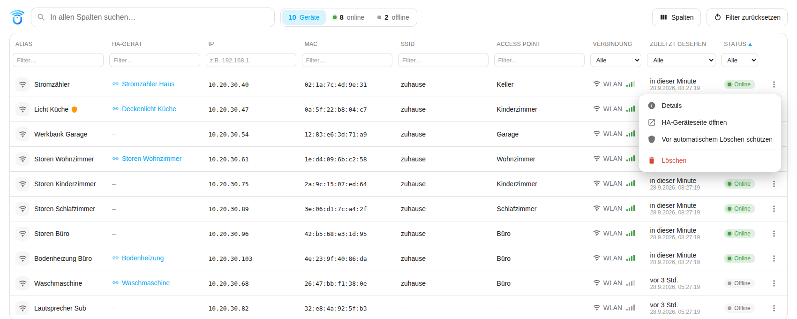
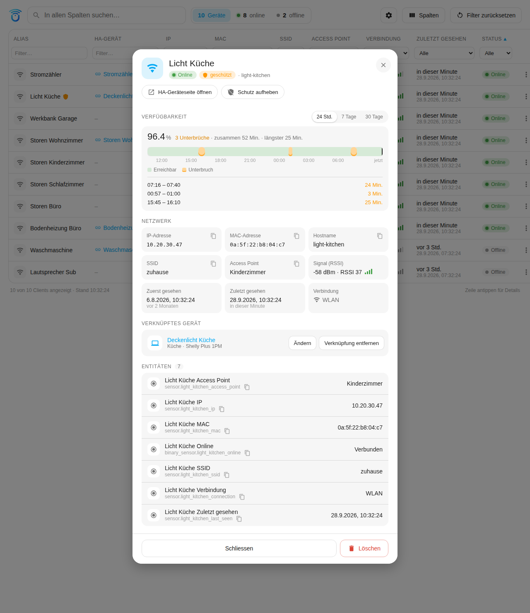
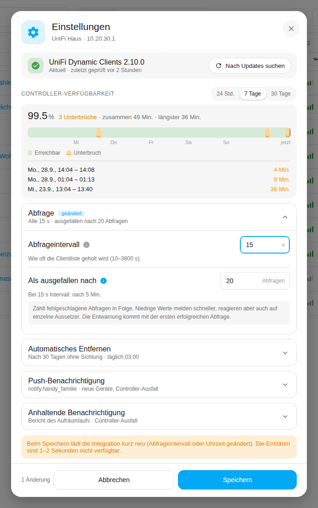
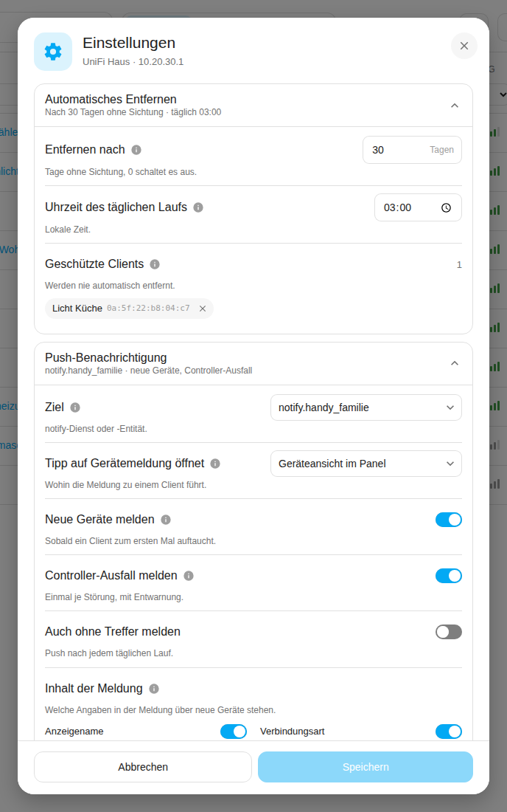

# UniFi Dynamic Clients

[English](README.md) · **Deutsch**

Home-Assistant-Integration, die pro UniFi-Client (verkabelt oder WLAN)
automatisch ein Gerät mit den passenden Entitäten anlegt und wieder entfernt,
sobald der Client vom UniFi-Controller länger nicht mehr gemeldet wird.

## Funktionen

- Legt pro Client ein Gerät mit Sensoren an: IP, MAC, SSID, Access Point,
  Verbindungsart und „Last seen" sowie einen Binary-Sensor „Online".
- Pro Hub ein Dienst-Gerät „<Hub> Controller" mit dem Binary-Sensor
  `binary_sensor.unifi_dynamic_controller_<host>` (Verbindung): an, solange
  der UniFi-Controller antwortet. Für Automationen und den Verlauf; im Panel
  erscheint es nicht, weil es kein Client ist.
- Persistenter Client-Cache: Werte offline gegangener Clients bleiben nach
  Neustart, Reload und Options-Änderung erhalten.
- Automatisches, konfigurierbares Entfernen („Purge") nach X Tagen ohne
  Sichtung, inklusive täglichem Lauf zu einer einstellbaren Uhrzeit.
- Einzelne Geräte lassen sich vom automatischen Entfernen ausnehmen.
- Aktion `unifi_dynamic.remove_client` zum gezielten Entfernen einzelner
  Clients, per Geräteauswahl oder MAC-Adresse.
- Aktion `unifi_dynamic.purge_now` zum manuellen Auslösen, wahlweise als
  Testlauf („dry run") ohne Löschen.
- Push-Benachrichtigung bei neu erkannten Clients, mit einzeln schaltbarem
  Inhalt (Anzeigename, Verbindungsart, SSID, Access Point, IP, MAC).
- Alle Push- und anhaltenden Benachrichtigungen sind zweisprachig: Deutsch
  oder Englisch, automatisch anhand der konfigurierten Sprache der
  Home-Assistant-Instanz gewählt (Englisch als Fallback für jede andere
  Sprache).
- Das Bild der Meldung bringt die Integration mit, nichts einzurichten.
- Die Neugeräte-Meldung wartet, bis alle gewählten Angaben tatsächlich
  vorliegen, und sendet dann sofort. Ein Tipp darauf öffnet die
  Geräteansicht des Clients im Panel, wahlweise seine Home-Assistant-Geräteseite. Zwei Buttons wirken direkt aus der Meldung heraus: „Nie
  entfernen" setzt den Client auf die Ausnahmeliste, „Jetzt entfernen" löscht
  ihn sofort.
- Der Purge setzt aus, solange der Controller nicht erreichbar ist. Ein Ausfall
  kann den Bestand damit nie löschen. Ein ausgesetzter Lauf wird gemeldet.
- Die Erreichbarkeit des Controllers bemisst sich an fehlgeschlagenen Abfragen
  in Folge, die Schwelle ist einstellbar. Gemeldet wird je Störung einmal, die
  Entwarnung kommt mit der ersten wieder erfolgreichen Abfrage. Push und
  anhaltende Benachrichtigung sind getrennt abschaltbar.
- Anhaltende Benachrichtigung in der Seitenleiste mit dem Bericht des letzten
  Purge-Laufs, getrennt schaltbar von der Push-Meldung.
- SSID- und Access-Point-Sensoren nur für Clients, die je im WLAN gesehen
  wurden. Reine Kabel-Clients bekommen sie nicht.
- Ein in der Seitenleiste angeheftetes Panel zeigt eine durchsuch- und
  filterbare Tabelle aller Clients über alle konfigurierten UniFi-Hosts
  hinweg (Alias, verknüpftes HA-Gerät, IP, MAC, SSID, Access Point, Verbindungsart, zuletzt
  gesehen, Online-Status), mit Menü pro Zeile zum Entfernen oder Eintragen
  in die Ausnahmeliste. Ein Tipp auf eine Zeile öffnet eine Geräteansicht mit
  allen Angaben, den Entitäten und denselben Aktionen.
- Optional: Antwortzeit per Ping. Gepingt werden die Online-Clients über ihre
  aktuelle IP aus UniFi (funktioniert mit DHCP ohne Pflege). Median,
  Schwankung und Paketverlust der letzten 24 Stunden im Panel; Entitäten
  „Ping" und „Packet loss" für jeden Client.

## Installation

Voraussetzung: Home Assistant 2024.12 oder neuer.

### Über HACS (Custom Repository)

1. HACS öffnen → Drei-Punkte-Menü (oben rechts) → **Custom repositories**.
2. Repository-URL `https://github.com/Diegofuego871/unifi_dynamic` eintragen,
   Kategorie **Integration** wählen.
3. „UniFi Dynamic Clients" in HACS suchen und installieren.
4. Home Assistant neu starten.

### Manuell

1. Ordner `custom_components/unifi_dynamic` aus diesem Repository in das
   `custom_components`-Verzeichnis der Home-Assistant-Konfiguration kopieren.
2. Home Assistant neu starten.

## Einrichtung

**Einstellungen → Geräte & Dienste → Integration hinzufügen → „UniFi Dynamic
Clients"**.

| Feld | Beschreibung |
| --- | --- |
| Host oder IP | Adresse des UniFi-Controllers, ohne `https://` |
| API-Key | API-Schlüssel des UniFi-Controllers |
| SSL-Zertifikat prüfen | Deaktivieren bei selbstsigniertem Zertifikat |
| Abfrageintervall | Wie oft die Clientliste abgefragt wird (Sekunden) |
| Entfernen nach Tagen ohne Sichtung | 0 deaktiviert das automatische Entfernen |

### Verbindung ändern

Host, API-Key und SSL-Prüfung lassen sich ändern, ohne den Hub zu löschen,
zum Beispiel nach einem neuen API-Key oder wenn ein Controller mit gleicher
oder neuer IP ersetzt wird:

- **⋮ → Neu konfigurieren** an der Integration: Host, neuer API-Key (leer
  lassen behält den bisherigen) und SSL-Prüfung.
- **Erneut authentifizieren**: Lehnt der Controller den Key ab (HTTP
  401/403), meldet Home Assistant das unter Einstellungen, dort wird nur der
  neue Key eingegeben.
- Im **Panel** unter Einstellungen → Verbindung (siehe [Panel](#panel)).

Alle drei Wege testen die Verbindung vor dem Speichern und behalten den
Hub: Geräte, Entitäten, Verknüpfungen, Schutzliste, Verlauf und
Einstellungen bleiben erhalten.

## Optionen

Nachträglich über **Konfigurieren** an der Integration erreichbar. Der Dialog
ist in sechs Abschnitte gegliedert, die beim Öffnen zugeklappt sind. Dieselben
Einstellungen lassen sich auch direkt im Panel über das Zahnrad bearbeiten
(siehe [Panel](#panel)); beide Wege schreiben in dieselben Optionen.

### Abfrage

| Option | Bedeutung | Vorgabe |
| --- | --- | --- |
| Abfrageintervall | Wie oft die Clientliste vom Controller geholt wird | 30 s |
| Als ausgefallen nach (Abfragen) | Fehlgeschlagene Abfragen in Folge, bis der Controller als ausgefallen gilt | 30 |

### Automatisches Entfernen

| Option | Bedeutung | Vorgabe |
| --- | --- | --- |
| Entfernen nach Tagen ohne Sichtung | Schwelle in Tagen, 0 deaktiviert das Entfernen | 30 |
| Uhrzeit des täglichen Laufs | Lokale Zeit des Aufräumlaufs | 19:00 |
| Geräte vom Entfernen ausnehmen | Mehrfachauswahl; ausgewählte Clients werden nie automatisch entfernt | leer |

### Push-Benachrichtigung

| Option | Bedeutung | Vorgabe |
| --- | --- | --- |
| Ziel für Push-Benachrichtigung | notify-Service oder notify-Entity, etwa eine notify-Gruppe | keines |
| Tipp auf eine Gerätemeldung öffnet | „Geräteansicht im Panel" oder „Home-Assistant-Geräteseite" (für alle, die das Panel nicht nutzen) | Geräteansicht im Panel |
| Auch melden, wenn nichts entfernt wurde | Push nach jedem täglichen Lauf, auch ohne Treffer | aus |
| Neue Geräte melden | Push, sobald ein Client zum ersten Mal auftaucht | an |
| Melden, wenn der Controller ausfällt | Push nach einer Stunde ohne erfolgreichen Poll, samt Entwarnung | an |
| Inhalt: … | Sechs Schalter für Anzeigename, Verbindungsart, SSID, Access Point, IP und MAC | alle an ausser MAC |

### Anhaltende Benachrichtigung

| Option | Bedeutung | Vorgabe |
| --- | --- | --- |
| Anhaltende Benachrichtigung erstellen | Bericht des Aufräumlaufs in der Seitenleiste | an |
| Auch erstellen, wenn nichts entfernt wurde | Andernfalls erscheint sie nur bei tatsächlichen Treffern | an |
| Auch erstellen, wenn der Controller ausfällt | Bleibt in der Seitenleiste, bis der Controller wieder antwortet | an |

### Updates

| Option | Bedeutung | Vorgabe |
| --- | --- | --- |
| Täglich nach Updates suchen | Fragt einmal täglich die veröffentlichten Releases auf GitHub ab (erste Prüfung zufällig 5–65 Minuten nach dem Start) und meldet eine neue Version unter **Einstellungen → Reparaturen**, mit Link zu den Release Notes. Die Meldung verschwindet nach dem Update oder beim Ausschalten. Ergänzt HACS, das nur alle paar Tage prüft; wer die doppelte Meldung nicht möchte, schaltet es aus. Gilt für die ganze Integration, solange es bei mindestens einem Hub an ist. | an |

### Ping (Antwortzeit)

| Option | Bedeutung | Vorgabe |
| --- | --- | --- |
| Antwortzeit messen | Schickt pro Runde drei Pings an jeden Client, der laut UniFi online ist und eine IP hat. Median, Schwankung (Jitter) und Paketverlust werden in einer eigenen Datei gehalten, nicht im Recorder: 24 Stunden in 5-Minuten-Blöcken, dazu 31 Tage in Stunden-Blöcken. In der Geräteansicht gilt der Schalter 24 Std./7 Tage/30 Tage auch für die Antwortzeit; Tabellenspalte und Entitäten zeigen die letzten 24 Stunden. Ein- und Ausschalten lädt die Integration kurz neu. | aus |
| Intervall (Sekunden) | Abstand zwischen zwei Runden, 30–3600. | 60 |

Hinweise:

- **Darstellung:** Fünf Balken in fünf Farben wie bei der Signalstärke:
  unter 5 ms grün (5 Balken), 5–15 ms hellgrün (4), 15–40 ms orange (3),
  40–100 ms violett (2), ab 100 ms rot (1). Dieselben Farben im Diagramm der
  Geräteansicht; Blöcke mit Paketverlust haben einen roten Deckel.
- **Median statt Mittelwert:** Ein einzelner Ausreisser, etwa ein Handy, das
  gerade aufwacht, verzerrt den Wert nicht.
- **Keine Antwort ist kein Fehler:** Windows-PCs blockieren Ping in der
  Firewall, Handys im Standby und batteriebetriebene IoT-Geräte antworten oft
  nicht, eine Firewall zwischen VLANs kann ICMP sperren. Solche Clients
  erscheinen als „antwortet nicht auf Ping".
- **Berechtigung:** Home Assistant muss ICMP-Pakete senden dürfen. In Home
  Assistant OS klappt das; bei Docker- oder Core-Installationen muss
  unprivilegierter Ping erlaubt sein (`net.ipv4.ping_group_range`) oder Home
  Assistant mit Root-Rechten laufen. Fehlt die Berechtigung, bleibt die
  Messung aus und das Panel zeigt einen Hinweis.
- **Entitäten:** Solange die Messung an ist, bekommt jeder Client
  `sensor.unifi_dynamic_<client>_ping` (Median in ms) und
  `sensor.unifi_dynamic_<client>_packet_loss` (%), mit den 24-Stunden-Werten
  als Attribute – für Automationen, Dashboards und den Verlauf wie jede
  andere Messgrösse in Home Assistant. Der Wert ist der des letzten
  abgeschlossenen 5-Minuten-Blocks und ändert sich höchstens alle 5 Minuten,
  unabhängig vom Intervall. Ausschalten entfernt die Entitäten wieder.
- **Recorder:** Die Attribute (Jitter, 24-Stunden-Werte, IP) werden nicht im
  Recorder gespeichert; live sind sie weiterhin sichtbar, ihr Verlauf steht
  im Panel. Pro Client und Sensor entstehen höchstens 288 Einträge pro Tag
  (etwa 70 Clients: rund 20 000). Zusätzlich löscht die Integration täglich
  zur Purge-Zeit (und kurz nach dem Start) Recorder-Einträge der
  Ping-Entitäten, die älter als 30 Tage sind – auch wenn `purge_keep_days`
  des Recorders länger eingestellt ist. Die Langzeitstatistik bleibt
  erhalten. Wer die Sensoren gar nicht im Recorder will, schliesst sie aus,
  z. B. `recorder: exclude: entity_globs: - sensor.unifi_dynamic_*_ping`.

## Aktion `unifi_dynamic.purge_now`

Löst den Aufräumlauf sofort aus, statt auf die eingestellte Uhrzeit zu warten.

| Feld | Pflicht | Beschreibung |
| --- | --- | --- |
| `dry_run` | Nein | Nur ermitteln, was entfernt würde. Es wird nichts gelöscht. |
| `entry_id` | Nein | Ohne Angabe laufen alle eingerichteten UniFi-Hosts. |

Die Aktion liefert eine strukturierte Antwort mit Anzahl entfernter Clients,
Entitäten und Geräte sowie der Anzahl ausgenommener Clients.

## Aktion `unifi_dynamic.remove_client`

Entfernt einzelne Clients sofort, unabhängig von der Schwelle und von der
Ausnahmeliste.

| Feld | Pflicht | Beschreibung |
| --- | --- | --- |
| `device_id` | Eines von beiden | Zu entfernende Geräte, Mehrfachauswahl möglich. |
| `mac` | Eines von beiden | MAC-Adressen, mehrere möglich. Doppelpunkte, Bindestriche, Punkte oder blanke Hexfolge. |
| `entry_id` | Nein | Nur für MAC-Adressen relevant. Ohne Angabe werden alle eingerichteten UniFi-Hosts durchsucht. |

Die Antwort nennt je Client den Entry, die MAC, den Namen, die Zahl entfernter
Entitäten und Geräte sowie ob er zu diesem Zeitpunkt online war — dann legt ihn
der nächste Abgleich wieder an, mit neuen Entity-IDs. Unbekannte Adressen
kommen mit `removed: false` zurück, statt den Aufruf scheitern zu lassen. Ein
noch aktiver Client taucht beim nächsten Abgleich wieder auf und wird erneut
als neu gemeldet - aus Sicht des Caches ist er das auch. Eine Bestätigungs-Push
gibt es nicht, die Antwort ist die Rückmeldung.

## Panel

Ein Panel namens „UniFi Dynamic Clients" ist in der Seitenleiste angeheftet
(nur für Administratoren sichtbar). Es zeigt eine Tabelle mit allen Clients
über alle konfigurierten UniFi-Hosts hinweg — Alias, verknüpftes HA-Gerät,
IP, MAC, SSID, Access Point, Verbindungsart, zuletzt gesehen und Status —,
die sich alle 10 Sekunden aktualisiert, solange das Panel offen ist.
WLAN-Clients zeigen ihr Signal als WLAN-Fächer neben der Verbindungsart (aus
dem dBm-Wert des Controllers: voll und grün ab -60 dBm, zwei Bögen orange ab
-67, ein Bogen violett ab -75, nur der Punkt rot darunter; grau, solange
offline), „zuletzt gesehen" steht relativ („vor 5 Min.") mit
der genauen Zeit darunter, und geschützte Clients tragen ein kleines Schild
neben dem Namen.

Die Suchleiste oben durchsucht alle Spalten gleichzeitig. Daneben zählt eine
Statusleiste die Geräte und wie viele davon online und offline sind — „40
Geräte · ● 34 online · ○ 6 offline" — über alle Hosts hinweg. Sie dient
zugleich als Online/Offline-Filter: ein Tipp auf „online" oder „offline"
zeigt nur diese Geräte, ein erneuter Tipp auf den aktiven Teil wieder alle.

Unter jeder Spaltenüberschrift steht ein eigener Filter: ein Textfeld für
Alias, HA-Gerät, IP, MAC, SSID und Access Point (Gross-/Kleinschreibung egal;
die MAC auch ohne Trennzeichen, „a1d0" findet „…:a1:d0") und eine Auswahl für
Verbindung (Alle/WLAN/Kabel), zuletzt gesehen (Alle/< 1 Std./< 24 Std./> 7
Tage) und Status (derselbe Zustand wie die Statusleiste). Alle Filter lassen
sich kombinieren. Aktive Filter sind hervorgehoben und stehen als Chips über
der Tabelle („Access Point: Büro ✕"), einzeln entfernbar oder alle auf
einmal mit „Alle entfernen". Die Zahlen der Statusleiste folgen den
Spaltenfiltern, beschreiben also immer die Gruppe, die man gerade anschaut –
nicht aber der Suche oder der Online/Offline-Auswahl selbst (sonst stünde
bei „online" 0, während man die Offline-Geräte ansieht). Titel- und
Filterzeile bleiben beim Scrollen stehen. Die Fusszeile zeigt, wie viele
Clients gelistet sind und wann die Daten zuletzt geholt wurden. Auf dem
Handy weicht die Filterzeile einem Filter-Button (mit der Zahl aktiver
Filter), der ein Blatt mit denselben Feldern und dem Button „12 von 40
Clients anzeigen" öffnet; die Alias-Spalte bleibt beim seitlichen Scrollen
stehen und zeigt Status-Punkt sowie Verbindung/Access Point unter dem Namen.

„Spalten" in der Werkzeugleiste öffnet eine kleine Liste mit einem Schalter
pro Spalte, um nicht benötigte auszublenden — HA-Gerät, IP, MAC, SSID,
Access Point, Verbindung, zuletzt gesehen und Status; der Alias bleibt
immer, weil er der Einstieg in die Geräteansicht ist. Mit dem Griff ≡ vor
jeder Spalte ändert sich die Reihenfolge: ziehen (Maus oder Finger) oder
Pfeiltasten auf dem Griff; der Alias bleibt vorn, das ⋮-Menü hinten.
„Alle einblenden" holt alle Spalten zurück, „Standard" stellt Sichtbarkeit
und Reihenfolge wieder her, ein Zähler am Button zeigt die Zahl
ausgeblendeter Spalten. Auf dem Handy stehen dieselben Schalter im Filter-Blatt. Der Filter
einer ausgeblendeten Spalte wirkt weiter und bleibt als Chip sichtbar.

Ein Klick auf eine Spaltenüberschrift sortiert die Tabelle aufsteigend
danach, ein erneuter Klick dreht auf absteigend um. Ein kleiner Pfeil
markiert die aktive Spalte und Richtung. Zeilen ohne Wert in der sortierten
Spalte (keine IP, nie gesehen) landen immer am Ende, unabhängig von der
Richtung.

Online/Offline-Auswahl, Verbindungsfilter, Sortierspalte und -richtung, die
ausgeblendeten Spalten samt Reihenfolge, der Schalter „Bereits verknüpfte ausblenden"
und der Zeitraum des Verfügbarkeits-Zeitstrahls werden pro Home-Assistant-Benutzer gespeichert, im eigenen Speicher von
Home Assistant für Frontend-Einstellungen — dort, wo Home Assistant auch
seine eigenen Tabelleneinstellungen ablegt. Sie gelten damit auf allen
Geräten und Browsern, mit denen du dich anmeldest, auch in der
Companion-App, und überstehen Neuladen und Neustarts. Ausgeblendete Spalten
und ihre Reihenfolge werden getrennt für Handy-Breite (bis 600px) und
breitere Bildschirme gespeichert, damit Änderungen am Handy den Desktop
nicht betreffen.
Suchtext, Textfilter pro Spalte und „zuletzt gesehen" werden bewusst nicht
gespeichert: sie gelten nur, solange das Panel offen ist. Jeder Browser hält
zusätzlich eine lokale Kopie für einen sofortigen Start; es gewinnt jeweils
der neuere Stand, und bietet Home Assistant den Speicher nicht an, gilt die
lokale Kopie. Einstellungen aus 2.4.0 und früher werden einmalig
übernommen. „Filter zurücksetzen" in der Werkzeugleiste (mit der Zahl
aktiver Filter) setzt Filter, Suche und Sortierung mit einem Klick zurück;
ausgeblendete Spalten bleiben ausgeblendet, sie gehören zum Layout, nicht zu
den Filtern.

Sind mehrere Hubs (UniFi-Controller) eingerichtet, erscheint neben „Spalten"
eine Hub-Auswahl: „Alle Hubs" zeigt die Clients aller Controller gemeinsam,
ein einzelner Hub nur dessen Clients samt passender Zählung. Die Wahl wird
pro Benutzer gespeichert. Gleich daneben öffnet das Zahnrad die
**Einstellungen** des gewählten Hubs — dieselben sechs Abschnitte wie im
Optionsdialog von Home Assistant (Abfrage, Automatisches Entfernen,
Push-Benachrichtigung, Anhaltende Benachrichtigung, Updates, Ping), mit einer
Zusammenfassung pro Abschnitt. Jedes Feld hat eine kurze Erklärung, das
ⓘ-Symbol klappt den ausführlichen Text auf; unter „Als ausgefallen nach"
steht die resultierende Reaktionszeit, zum Beispiel „Bei 30 s Intervall:
nach 15 Min.". Geschützte Clients erscheinen als Liste und lassen sich dort
entfernen (hinzufügen geht über „Schützen" in der Tabelle). Geänderte
Felder sind markiert, gespeichert wird erst mit „Speichern". Ändern sich
Abfrageintervall oder Uhrzeit des Laufs, lädt die Integration dabei kurz
neu, worauf der Dialog vorher hinweist. Bei „Alle Hubs" ist das Zahnrad
gesperrt, weil die Einstellungen pro Hub gelten; mit nur einem Hub gibt es
keine Auswahl, nur das Zahnrad.

Zuunterst zeigt der zuklappbare Abschnitt **Verbindung** (zugeklappt mit
Host und Status als Zusammenfassung) Host/IP, SSL-Prüfung, ob ein
API-Key hinterlegt ist, und den Status („Verbunden", „API-Key ungültig",
„Nicht erreichbar"). Der Key selbst wird nie angezeigt, auch nicht
teilweise. „Verbindung ändern…" öffnet einen kleinen Dialog für Host, neuen
API-Key (leer lassen behält den bisherigen) und SSL-Prüfung. Vor dem
Speichern wird die Verbindung getestet; schlägt der Test fehl, bleibt alles
unverändert und der Dialog nennt den Grund („API-Key ungültig", „Host nicht
erreichbar"). Ein Host, den bereits ein anderer Hub verwendet, wird
abgelehnt. Nach dem Speichern lädt die Integration neu; der Hub bleibt
derselbe, Geräte, Entitäten, Verknüpfungen, Schutzliste, Verlauf und
Einstellungen bleiben erhalten. Lehnt der Controller den Key ab, erscheint
zuoberst in den Einstellungen ein Hinweis mit dem Knopf „API-Key erneuern".

Ganz oben in den Einstellungen steht die **Version** der Integration mit
dem Knopf „Nach Updates suchen". Die Integration fragt dafür selbst die
veröffentlichten Releases auf GitHub ab (auch ohne HACS; beim Öffnen
höchstens alle 6 Stunden, dazu die tägliche Prüfung aus dem Abschnitt
„Updates") und lässt, falls vorhanden, zugleich die
Update-Entität von HACS neu prüfen. Gibt es eine neuere Version, erscheinen
„Version x verfügbar", ein Link zu den Release Notes und — wenn die
Integration über HACS installiert ist — der Knopf „Aktualisieren". Er
installiert über HACS (derselbe Weg wie Einstellungen → Updates), ein
Balken zeigt die laufende Installation. Kennt HACS eine neue Version noch
nicht (GitHub ist schneller), lässt das Panel HACS die Versionen neu laden
und bietet den Knopf erst an, wenn HACS sie kennt — bis dahin steht ein
Hinweis in der Zeile. Danach meldet die Zeile „Neustart
nötig" mit dem Knopf „Jetzt neu starten", der vorher nachfragt; erst nach
dem Neustart von Home Assistant ist die neue Version aktiv. Ohne HACS gibt
es nur den Hinweis mit Link, installiert wird dann manuell.

Mit dem Schalter **„Vorabversionen anzeigen"** unter der Versionszeile
(pro Benutzer gespeichert) bietet das Panel auch Beta-Versionen an, sofern
sie neuer sind als das letzte stabile Release. Als Vorabversion gilt, was
auf GitHub als Pre-Release markiert ist oder einen Zusatz wie `b1` oder
`rc1` in der Nummer trägt. Die Zeile ist dann violett
mit dem Etikett „Beta". HACS installiert Vorabversionen nur, wenn bei
dieser Integration im HACS-Gerät die Entität „Pre-release" aktiviert und
eingeschaltet ist. HACS legt sie deaktiviert an; der Knopf **„In HACS
freischalten"** im Hinweis aktiviert sie, wartet, bis HACS neu geladen hat
(etwa 30 Sekunden), und schaltet sie ein. Schaltest du „Vorabversionen
anzeigen" wieder aus, schaltet das Panel sie wieder aus, aber nur, wenn es
sie selbst eingeschaltet hat. Bis dahin bleibt „Aktualisieren" gesperrt; der
Hinweis verlinkt auch direkt zum HACS-Gerät. Die tägliche
Prüfung unter „Reparaturen" meldet nie Vorabversionen.

Darunter steht die **Controller-Verfügbarkeit** als Kachel mit dem Wert der
letzten 24 Stunden, daneben der Verbindungsstatus. Ein Tipp auf die Kachel
öffnet ein Unter-Fenster mit dem Zeitstrahl:
derselbe Zeitstrahl wie in der Geräteansicht, aber für den UniFi-Controller
des Hubs — wann er erreichbar war und wann nicht, mit Prozent,
Unterbrüchen und Liste. Der Zeitraum (24 Std. / 7 Tage / 30 Tage) ist mit der
Geräteansicht geteilt. Als Unterbruch zählt die Zeit von der letzten
erfolgreichen bis zur ersten wieder erfolgreichen Abfrage, sobald die
Schwelle „Als ausgefallen nach" erreicht war; kürzere Aussetzer erscheinen
nicht. Die Daten stammen aus dem eigenen Verfügbarkeitsprotokoll der
Integration und beginnen mit dem Update auf 2.9.0; Zeiten, in denen Home
Assistant nicht lief, sind schraffiert (ein normaler Neustart bis
5 Minuten nicht). Fällt der Controller erst nach einem Neustart aus, beginnt
der Unterbruch beim Start von Home Assistant, nicht schon vor dem Neustart.

Die Abschnitte im Einzelnen:

| Abschnitt | Einstellungen |
|---|---|
| Abfrage | Abfrageintervall (10–3600 s) und „Als ausgefallen nach" (Anzahl fehlgeschlagener Abfragen, darunter die daraus folgende Reaktionszeit) |
| Automatisches Entfernen | Tage ohne Sichtung bis zum Entfernen (0 = aus), Uhrzeit des täglichen Laufs und die geschützten Clients mit Knopf zum Aufheben des Schutzes |
| Push-Benachrichtigung | Ziel (notify-Dienst oder -Entität), wohin ein Tipp auf eine Gerätemeldung führt, Auslöser (neue Geräte, Controller-Ausfall, auch ohne Treffer) und der Inhalt der Neugeräte-Meldung in zwei Spalten |
| Anhaltende Benachrichtigung | Bericht des Aufräumlaufs, auch ohne Treffer, und Meldung bei Controller-Ausfall |
| Updates | Tägliche Prüfung auf eine neue Version mit Meldung unter „Reparaturen" |

Ohne Änderung bleibt „Speichern" ausgegraut. Ungültige Werte, etwa ein
Intervall unter 10 Sekunden, markiert das Feld rot mit dem erlaubten
Bereich, und gespeichert wird erst, wenn alles gültig ist. Home Assistant
prüft beim Speichern dieselben Grenzen noch einmal. „Abbrechen", Esc oder
ein Klick neben den Dialog verwerfen den Entwurf.

Jede Zeile hat ein ⋮-Menü mit „Details", „Vor automatischem Löschen schützen" (trägt
den Client in die Ausnahmeliste ein), „Löschen" (fragt zuerst nach, entfernt
dann sofort — dasselbe Verhalten wie der Meldungs-Button und die Aktion
`remove_client`: ein noch aktiver Client wird beim nächsten Abgleich neu
angelegt und erneut als neu gemeldet) und „HA-Geräteseite öffnen". Steht ein
Client schon auf der Ausnahmeliste, zeigt das Menü stattdessen „Nicht mehr
schützen", um ihn wieder davon zu entfernen. Der erste Menüpunkt,
„Details", öffnet die Geräteansicht — ebenso ein Tipp auf die Zeile selbst.

Die Geräteansicht ist ein Dialog über der Tabelle (auf dem Handy ein Blatt,
das von unten hereinfährt). Der Kopf zeigt Name, Status und Schutz als
Pillen sowie den Hostnamen; direkt darunter stehen die Schnellaktionen
„HA-Geräteseite öffnen" und „Schützen" bzw. „Schutz aufheben".

Darunter stehen die **Statistik-Kacheln** mit dem Wert der letzten 24
Stunden: Verfügbarkeit (Prozent und Unterbrüche), WLAN (Median der
Signalstärke mit WLAN-Fächer, nur bei WLAN-Clients) und Antwortzeit (nur
wenn Ping aktiv ist). Die Werte kommen mit der Clientliste; ein Tipp auf
eine Kachel öffnet ein Unter-Fenster mit Zeitraum-Schalter (24 Std. / 7
Tage / 30 Tage, gemeinsam für alle Unter-Fenster und pro Benutzer
gespeichert) und Diagramm. Geladen wird erst dort; das X schliesst nur
das Unter-Fenster, die Geräteansicht dahinter bleibt offen.

Das Unter-Fenster **„WLAN-Empfang"** zeigt Median, besten und
schlechtesten Wert der Signalstärke, ein Diagramm in den Farben des
WLAN-Fächers, die genutzten Access Points mit ihrem Anteil und wie lange der
Client ohne WLAN-Daten war (am Kabel oder ausser Haus). Die Integration
zeichnet die Signalstärke seit 2.15.0 bei jeder Abfrage auf, in einer eigenen
Datei und nicht im Recorder: 24 Stunden in 5-Minuten-Blöcken, 31 Tage in
Stunden-Blöcken.

Das Unter-Fenster „Verfügbarkeit" zeigt als Zeitstrahl, wann der Client
erreichbar war (grün) und wann nicht (orange) — wahlweise für die letzten
24 Stunden, 7 Tage oder 30 Tage (die Wahl wird pro Benutzer gespeichert).
Darüber stehen die Verfügbarkeit in Prozent, die Anzahl Unterbrüche, ihre
Gesamtdauer und der längste; Überfahren oder Antippen eines Unterbruchs
zeigt Beginn, Ende und Dauer, darunter sind alle Unterbrüche aufgelistet
(neueste zuerst). Die Daten stammen aus einem eigenen, schlanken
Verfügbarkeitsprotokoll der Integration: Sie merkt sich pro Client nur die
Wechsel zwischen online und offline, 31 Tage lang und unabhängig von der
Aufbewahrungsdauer des Recorders. Dadurch lädt auch die 30-Tage-Ansicht
sofort. Für die Zeit, bevor das Protokoll lief (die ersten Tage nach dem
Update auf 2.7.0), ergänzt das Panel den Recorder-Verlauf der
Online-Entität; das kann bei langen Zeiträumen einige Sekunden dauern —
währenddessen läuft eine Lade-Animation (wählbar unter Einstellungen → Loader: Elefant auf dem Ball, Katze, Hamster im Laufrad, Pinguin mit Eisbär, Laufvogel mit Kojote oder Zufall; gespeichert pro Benutzer und sofort wirksam, ohne „Speichern“). Zeiten ohne Daten
(bevor der Client bekannt war, während Home Assistant nicht lief oder der
UniFi-Controller nicht erreichbar war) sind schraffiert und zählen nicht
mit. Deckt die Aufzeichnung weniger als 10 % des gewählten Zeitraums ab
(etwa kurz nach der Installation), beginnt der Balken erst beim ersten
Datenpunkt; links steht dann dessen Zeitpunkt, der Hinweis „erst seit …"
bleibt. Ein Neustart von Home Assistant erscheint nicht als Unterbruch: Lücken
bis 5 Minuten zwischen zwei gleichen Zuständen gelten als durchgehend,
erst längere Ausfälle von Home Assistant werden schraffiert. Echte
Unterbrüche sind davon nie betroffen, nur Zeiten ohne Daten. Einschränkung: Unterbrüche, die kürzer sind als Abfrageintervall plus
Offline-Schwelle, sind nicht sichtbar.

Der Abschnitt „Netzwerk" zeigt alles, was die Integration über den Client weiss, als
Kacheln: IP, MAC, Hostname, SSID, Access Point, Signal (dBm, der RSSI-Wert
des Controllers und Balken, bei einem Offline-Client als „zuletzt gemessen"
markiert), zuerst und zuletzt gesehen mit relativer Zeitangabe sowie die
Verbindungsart. Darunter folgen das verknüpfte Gerät und die
Home-Assistant-Entitäten des Clients mit ihrem aktuellen Zustand — ein Tipp
darauf öffnet den Entitäts-Dialog von Home Assistant mit Verlauf. Die
Leiste unten enthält „Schliessen" und „Löschen".
Nach erfolgreichem Löschen schliesst sich der Dialog von selbst; schlägt eine
Aktion fehl, steht der Fehler im Dialog. Esc, der ×-Button oder ein Klick
neben den Dialog schliessen ihn. Kabel-Clients zeigen die WLAN-Felder nicht.

Jeder Client lässt sich mit einem beliebigen Home-Assistant-Gerät
verknüpfen — etwa dem Shelly- oder Sonos-Gerät hinter diesem Netzwerk-Client.
In der Geräteansicht öffnet „Gerät verknüpfen…" eine durchsuchbare Liste
aller Home-Assistant-Geräte (Name, Bereich, Hersteller); Geräte, die dieselbe
MAC-Adresse wie der Client melden, stehen als Vorschlag oben unter „Passt zur
MAC-Adresse". Geräte, die bereits mit einem anderen Client verknüpft sind,
tragen den Hinweis „Bereits verknüpft mit: …" mit dessen Namen und stehen nach
den freien Geräten; sie bleiben wählbar, weil ein Home-Assistant-Gerät zu
mehreren Clients gehören kann (etwa LAN- und WLAN-Anschluss desselben Geräts).
Der Schalter „Bereits verknüpfte ausblenden" in der Liste blendet sie
stattdessen aus; die Einstellung wird pro Benutzer gespeichert, und das Gerät des
gerade bearbeiteten Clients bleibt immer sichtbar. Danach zeigt die Ansicht das verknüpfte Gerät mit Bereich und
Modell, „Ändern" und „Verknüpfung entfernen", ein Klick auf den Namen öffnet
seine Geräteseite. Die Tabelle hat eine Spalte „HA-Gerät" mit dem Namen des
verknüpften Geräts, ein Klick führt direkt auf dessen Geräteseite; die Spalte
ist sortierbar, und die Suche findet Clients auch über Namen und Bereich des
verknüpften Geräts.

Die Verknüpfung speichert nur diese Integration; das verknüpfte Gerät selbst
wird nie verändert. Geräte dieser Integration und der offiziellen
UniFi-Network-Integration sind nicht verknüpfbar und erscheinen nicht in der
Liste: UniFi Network legt für dieselben Clients (und für Access Points und
Switches) eigene Geräte an, als Verknüpfungsziel wären sie nur eine Doppelung
des Clients. Ein Gerät, das sich UniFi Network mit einer anderen Integration
teilt, etwa einem Shelly, bleibt wählbar. Zeigt eine Verknüpfung trotzdem auf
ein solches Gerät (gesetzt vor Version 2.2.1), wird sie automatisch entfernt.
Die Verknüpfung übersteht Neustarts und Updates. Wird der Client entfernt — von Hand oder
durch den Purge —, geht die Verknüpfung mit, und ein später neu angelegter
Client muss neu verknüpft werden; die Schutzfunktion bewahrt einen Client
(und damit seine Verknüpfung) vor dem Purge. Wird das verknüpfte Gerät in
Home Assistant gelöscht, fällt die Verknüpfung automatisch weg. Bewusst keine
Zusammenführung über die MAC-Adresse: Sie würde die Geräte dieser Integration
an Geräte anderer Integrationen binden, und das Entfernen eines Clients
könnte dann das fremde Gerät mitnehmen.

Neben IP, MAC, Hostname, SSID, Access Point und jeder Entity-ID steht ein
kleiner Kopieren-Button, der genau diesen Wert in die Zwischenablage legt —
bei einer Entität nur ihre ID, etwa `sensor.unifi_dynamic_…_connection`. Das
Symbol wird kurz zum Häkchen, und Home Assistant zeigt unten kurz „Kopiert:
…". Das Kopieren klappt auch, wenn Home Assistant über reines `http://`
erreichbar ist, wo Browser die Zwischenablage-Schnittstelle nicht anbieten:
Das Panel weicht dann auf den älteren Kopierbefehl des Browsers aus.

„Zuerst gesehen" stammt aus dem Feld `first_seen` des Controllers und reicht
damit auch vor die Installation zurück. Liefert der Controller es nicht,
nimmt die Integration den Zeitpunkt, zu dem sie den Client selbst zum ersten
Mal gesehen hat — ausser bei Clients, die bei Einrichtung oder Update schon
bekannt waren: Die zeigen „unbekannt" statt eines erfundenen Datums.

Ein Tipp auf die Zeile führte früher direkt auf die Geräteseite und damit
weg vom Panel, was beim Scrollen zu leicht passierte. Der Dialog ist dagegen
abgesichert: Eine Wischbewegung zählt ohnehin nie als Tipp, und auch ein Tipp
innerhalb von 300 ms nach dem Scrollen (der Tipp, der auf dem Handy eine
Schwungbewegung stoppt), ein Tipp bei offenem Zeilenmenü (schliesst nur das
Menü) und das Markieren von Text (etwa um eine MAC zu kopieren) öffnen ihn
nicht.

Push-Meldungen zu einem einzelnen Client verlinken auf
`/unifi-dynamic?entry=<Entry-ID>&mac=<MAC>`; das Panel öffnet die
Geräteansicht dieses Clients und entfernt die Parameter danach aus der
Adresse, damit ein Neuladen sie nicht erneut öffnet. Das funktioniert auch
bei bereits offenem Panel. Existiert der Client nicht mehr, erscheint ein
Hinweis. Wer das Panel nicht nutzt, stellt das Ziel in den Optionen („Tipp
auf eine Gerätemeldung öffnet", Abschnitt Push) auf die
Home-Assistant-Geräteseite zurück.

Bei mehr als einem konfigurierten UniFi-Host zeigt die Tabelle eine
Host-Spalte und listet die Clients aller Hosts gemeinsam, statt ein Panel
pro Host aufzuspalten.

Das Menü positioniert sich anhand der tatsächlichen Bildschirmposition des
Buttons und öffnet automatisch nach oben, wenn unten nicht genug Platz ist
— nötig, weil die Tabelle selbst scrollt, was das Menü bei Zeilen nahe dem
unteren Rand des sichtbaren Bereichs sonst abschneiden würde. Das Icon der
Integration erscheint am Anfang der Werkzeugleiste neben dem Suchfeld,
dasselbe Bild, das schon für Push-Meldungen ausgeliefert wird; scheitert
das Laden, blendet es sich selbst aus, statt ein kaputtes Bild-Icon zu
zeigen.

Die Kopfzeile über dem Panel — Titel und, auf einem schmalen Bildschirm wie
den iOS-/Android-Begleit-Apps, der Menü-Button zum Öffnen der Seitenleiste
samt Punkt für offene Mitteilungen — ist die von Home Assistant selbst,
dieselbe wie bei den eingebauten Panels. Darunter bleiben Suchfeld und
Filter stehen; nur die Tabelle scrollt, nach oben/unten und auf dem Handy,
wo nicht alle Spalten Platz haben, auch seitwärts. Die Spaltenüberschriften
bleiben beim Scrollen nach unten oben stehen und laufen beim seitlichen
Scrollen mit ihren Spalten mit.

Technisch ist das Panel als eines der eingebauten iframe-Panels von Home
Assistant registriert, das auf `panel/panel.html` in dieser Integration
zeigt — derselbe Ansatz wie z.B. bei Orphan Cleaner. Home Assistant zeichnet
die Kopfzeile um das iframe herum und gibt ihm eine feste Höhe, wodurch der
Tabellenbereich überhaupt erst eigenständig scrollen kann. Die Seite darin
nutzt die bestehende, bereits angemeldete Verbindung von Home Assistant aus
dem umgebenden Fenster (kein eigenes Login, kein Token) und übernimmt die
Farben des aktiven Designs, passt sich also hellem und dunklem Modus an.
Die Tabelle selbst ist ein eigenständiges Web Component ohne externe
Bibliothek und ohne Build-Schritt — HACS installiert diese Integration als
reine Dateikopie, es gibt also nichts zu bündeln. Sie spricht mit dem
Backend über sechs WebSocket-Befehle (`unifi_dynamic/list_clients`,
`unifi_dynamic/remove_client`, `unifi_dynamic/exclude_client`,
`unifi_dynamic/unexclude_client`, dazu `unifi_dynamic/list_devices` und
`unifi_dynamic/link_device` für die Verknüpfungen), die ersten vier dünne Wrapper um dieselbe
Coordinator-Logik, die Meldungsaktionen und die Aktion `remove_client` schon
nutzen — für das Panel existiert keine eigene Entfernen- oder
Ausnahmeliste-Logik. Alle sechs Befehle verlangen Administratorrechte,
passend zur `require_admin`-Einstellung des Panels selbst.

Panel-Texte sind wie die Meldungen zweisprachig, die Sprachquelle
unterscheidet sich aber bewusst: Das Panel liest `hass.language`, die
Frontend-Sprache des angemeldeten Nutzers, weil ein Panel pro
Browser-Sitzung für die Person gerendert wird, die gerade hinschaut — anders
als eine Meldung, die die Integration verschickt, ohne zu wissen, wer sie
liest, und die deshalb die konfigurierte Instanzsprache
`hass.config.language` verwendet.

## Funktionsweise

Die Integration fragt `/stat/sta` ab, also die Liste der aktiven Clients. Ein
Client, der nicht mehr erscheint, verschwindet nicht sofort: Sein letzter
Stand bleibt im Cache und altert. Grundlage dafür ist ein eigener Zeitstempel,
der bei jeder Sichtung gesetzt wird, nicht das UniFi-Feld `last_seen`. Damit
sind Millisekunden-Varianten, fehlende Werte und eine abweichende
Controller-Uhr kein Thema.

War Home Assistant länger als eine Stunde ohne erfolgreichen Poll, wird die
Ausfallzeit allen Zeitstempeln gutgeschrieben. Sonst würde ein Neustart nach
längerem Stillstand sämtliche Clients auf einmal als überfällig einstufen.

Der Purge misst das Alter gegen den letzten erfolgreichen Poll, nicht gegen die
Wanduhr, und setzt ganz aus, wenn dieser länger als eine Stunde zurückliegt.
Bei nicht erreichbarem Controller würden die Zeitstempel sonst weiter altern,
obwohl kein Client tatsächlich verschwunden ist, und der Lauf würde einen noch
existierenden Bestand löschen. Ein ausgesetzter Lauf wird gemeldet, samt
Angabe, wie lange der Controller schweigt.

Der Button „Nie entfernen" in der Neugeräte-Meldung schreibt in dieselbe Option
`purge_exclude`, die auch der Dialog bearbeitet; beide Wege bleiben damit
konsistent. Entry-ID und MAC stecken im Aktions-Key, die Integration lauscht
auf `mobile_app_notification_action` und ignoriert alles Fremde. Zu beachten:
Wird der Optionsdialog gespeichert, während er offen war, überschreibt er eine
zwischenzeitliche Ergänzung — er schreibt immer die Liste, die er beim Öffnen
geladen hat.

„Jetzt entfernen" löscht den Client sofort, ohne Rücksicht auf die Schwelle und
auf die Ausnahmeliste. Gedacht ist der Button für Clients, die das Netz bereits
verlassen haben: Ein noch aktiver Client wird vom nächsten Poll wieder angelegt,
mit neuen Entity-IDs, und erneut als neues Gerät gemeldet.

Ein Fehler bei der Verarbeitung einer der beiden Aktionen wird jetzt immer mit
Art, MAC und Entry-ID geloggt, statt nur der Bestätigungsschritt abgedeckt zu
sein. Mit aktiviertem Debug-Logging für `custom_components.unifi_dynamic`
erscheint bei einem Tastendruck, der bei Home Assistant ankommt, sofort die
Zeile „Meldungsaktion ... empfangen". Fehlt diese Zeile nach einem Tastendruck
ganz, erreicht das Ereignis Home Assistant gar nicht erst — dann liegt es am
Telefon oder an der Companion-App, nicht an der Integration.

Beide Aktionsbuttons setzen explizit `"behavior": "background"`, ein
Tastendruck löst damit nur das Event aus und navigiert die App nirgendwohin.
Die Bestätigungs-Push bekommt einen eigenen Tag statt des Tags der
ursprünglichen Neugeräte-Meldung: iOS entfernt eine Meldung meist
automatisch, sobald eine Aktion darauf getippt wird, und eine Bestätigung mit
demselben Tag kurz danach kam je nach Timing manchmal nicht mehr als eigener
Banner an.

Jeder Meldungs- und Anhaltend-Benachrichtigungstext, einschliesslich dieser
beiden Button-Labels, ist zweisprachig. Die Sprache wird pro Meldung aus
`hass.config.language` bestimmt, der konfigurierten Instanzsprache: Deutsch
bei `de`/`de-*`, Englisch als Fallback für alles andere. Das ist die Sprache
der Instanz, nicht zwingend die Sprache des Telefons, auf dem die Meldung
gelesen wird — bei den meisten Ein-Haushalt-Setups stimmt beides überein.
Alle Meldungstexte liegen in `msg.py`, beide Sprachen nebeneinander pro
Meldung, getrennt von `strings.json`/`translations/*.json`, die nur den
Options-Dialog abdecken und clientseitig vom Home-Assistant-Frontend
gerendert werden.

Da ein fehlgeschlagener Poll bewusst nicht als Coordinator-Fehler gilt — der
Cache wird weitergereicht, damit kurze Aussetzer nicht alle Entitäten auf
unavailable kippen — würde ein Ausfall sonst erst beim nächsten Purge-Lauf
auffallen. Deshalb werden fehlgeschlagene Abfragen in Folge gezählt; ist die
eingestellte Zahl erreicht, geht die Meldung sofort raus. Der Zähler wird bei
jedem Erfolg zurückgesetzt, einzelne Aussetzer summieren sich also nie. Die
Entwarnung samt Dauer kommt mit der ersten wieder erfolgreichen Abfrage.

Diese Schwelle steuert nur die Meldung. Der Purge behält seine eigene Schwelle
von einer Stunde, denn ein kurzer Ausfall gefährdet den Bestand nicht, und eine
empfindlich eingestellte Meldeschwelle soll nicht den täglichen Lauf aussetzen
lassen.

Das Bild in den Push-Meldungen liefert die Integration selbst aus: Der Ordner
`brand/` wird als statischer Pfad unter `/unifi_dynamic/` registriert, also
über denselben Mechanismus wie `/local/`. Das Bild ist optional: Fehlt es,
entfällt nur das Bild, Klickziel und Tag bleiben. Lehnt ein
Benachrichtigungsziel die Zusatzdaten insgesamt ab, wird die Meldung ohne sie
erneut gesendet — dann ohne Bild, Klickziel und Tag.

Das Klickziel wird als `url` und als `clickAction` mitgeschickt, weil iOS den
ersten Schlüssel liest und Android nur den zweiten. Unter iOS fragt die
Companion-App beim ersten Klick auf eine Meldung mit URL „Adresse öffnen?".
Diese Rückfrage gehört zur App, nicht zu dieser Integration: Sie hängt an
„Adressen öffnen bestätigen" in den allgemeinen Einstellungen der App und
lässt sich in der Rückfrage selbst mit „Immer geöffnet" dauerhaft abstellen.

Die Namen der Access Points stammen aus `/stat/device`. Diese Liste wird
deutlich seltener geholt als die Clientliste und im Cache gehalten. Schlägt
der Abruf fehl, zeigen die Sensoren die MAC des Access Points.

## Changelog

Siehe [CHANGELOG.md](CHANGELOG.md).

## Lizenz

Siehe [LICENSE](LICENSE).
