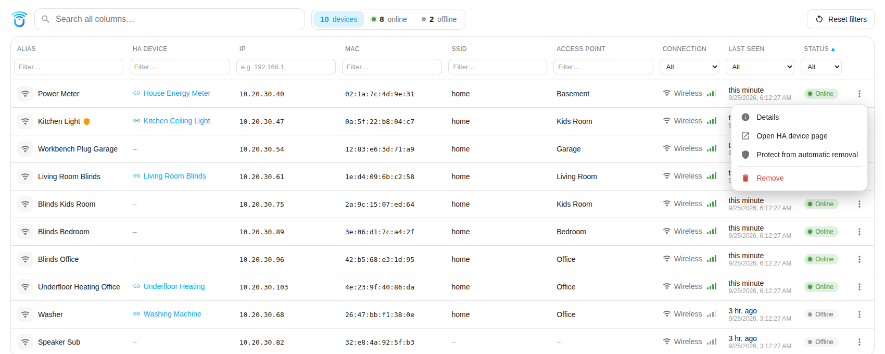
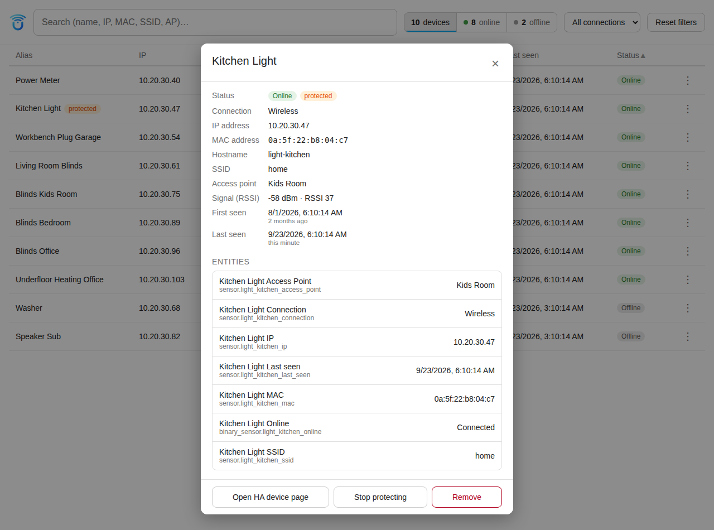

# UniFi Dynamic Clients

**English** · [Deutsch](README.de.md)

Home Assistant integration that automatically creates a device with matching
entities for every UniFi client, wired or wireless, and removes it again once
the client has not been reported by the UniFi controller for a while.

## Features

- Creates one device per client with sensors for IP, MAC, SSID, access point,
  connection type and "Last seen", plus an "Online" binary sensor.
- Persistent client cache: values of clients that went offline survive
  restarts, reloads and option changes.
- Configurable automatic removal ("purge") after X days without a sighting,
  including a daily run at a configurable time.
- Individual devices can be excluded from automatic removal.
- Action `unifi_dynamic.remove_client` to remove individual clients on demand,
  by device or by MAC address.
- Action `unifi_dynamic.purge_now` to trigger the run manually, optionally as
  a dry run without deleting anything.
- Push notification for newly detected clients, with individually selectable
  content (display name, connection type, SSID, access point, IP, MAC).
- All push and persistent notifications are bilingual: German or English,
  chosen automatically from the Home Assistant instance's configured
  language (English as the fallback for any other language).
- The notification image ships with the integration, nothing to configure.
- The new-device notification waits until every selected detail is actually
  available, then sends immediately. Tapping it opens that client's device
  view in the panel, or optionally its Home Assistant device page. Two buttons act right from the notification: "Never remove" adds the
  client to the exclusion list, "Remove now" deletes it immediately.
- The purge is skipped while the controller is unreachable, so an outage can
  never delete the inventory. A skipped run is reported.
- The controller's reachability is judged by consecutive failed polls, with
  the threshold configurable, and reported once per outage. The all-clear goes
  out with the first successful poll. Push and persistent notification can be
  switched off separately.
- Persistent notification in the sidebar with the report of the last purge
  run, toggled separately from the push notification.
- SSID and access point sensors only for clients that have been seen on
  wireless. Wired-only clients do not get them.
- A panel pinned in the sidebar shows a searchable, filterable table of every
  client across all configured UniFi hosts (alias, linked HA device, IP, MAC, SSID, access
  point, connection type, last seen, online status), with a per-row menu to
  remove a client or add it to the exclusion list. Tapping a row opens a
  device view with every detail, its entities and the same actions.

## Installation

Requires Home Assistant 2024.12 or newer.

### Via HACS (custom repository)

1. Open HACS → three-dot menu (top right) → **Custom repositories**.
2. Enter the repository URL `https://github.com/Diegofuego871/unifi_dynamic`
   and choose the category **Integration**.
3. Search for "UniFi Dynamic Clients" in HACS and install it.
4. Restart Home Assistant.

### Manually

1. Copy the folder `custom_components/unifi_dynamic` from this repository into
   the `custom_components` directory of your Home Assistant configuration.
2. Restart Home Assistant.

## Setup

**Settings → Devices & services → Add integration → "UniFi Dynamic Clients"**.

| Field | Description |
| --- | --- |
| Host or IP | Address of the UniFi controller, without `https://` |
| API key | API key of the UniFi controller |
| Verify SSL certificate | Disable for a self-signed certificate |
| Polling interval | How often the client list is fetched (seconds) |
| Remove after days without a sighting | 0 disables automatic removal |

## Options

Available afterwards via **Configure** on the integration. The dialog is
grouped into four sections, collapsed when opened.

### Polling

| Option | Meaning | Default |
| --- | --- | --- |
| Polling interval | How often the client list is fetched from the controller | 30 s |
| Considered down after (polls) | Consecutive failed polls before the controller counts as down | 30 |

### Automatic removal

| Option | Meaning | Default |
| --- | --- | --- |
| Remove after days without a sighting | Threshold in days, 0 disables removal | 30 |
| Time of the daily run | Local time of the cleanup run | 19:00 |
| Exclude devices from removal | Multi-select; the chosen clients are never removed automatically | empty |

### Push notification

| Option | Meaning | Default |
| --- | --- | --- |
| Push notification target | notify service or notify entity, for example a notify group | none |
| Tapping a device notification opens | "Device view in the panel" or "Home Assistant device page" (for anyone not using the panel) | device view in the panel |
| Also report when nothing was removed | Push after every daily run, even with no hits | off |
| Report new devices | Push as soon as a client appears for the first time | on |
| Report when the controller goes down | Push after an hour without a successful poll, plus an all-clear | on |
| Content: … | Six switches for display name, connection type, SSID, access point, IP and MAC | all on except MAC |

### Persistent notification

| Option | Meaning | Default |
| --- | --- | --- |
| Create persistent notification | Report of the cleanup run in the sidebar | on |
| Also create when nothing was removed | Otherwise it only appears on actual hits | on |
| Also create when the controller goes down | Stays in the sidebar until the controller answers again | on |

## Action `unifi_dynamic.purge_now`

Triggers the cleanup run immediately instead of waiting for the configured
time.

| Field | Required | Description |
| --- | --- | --- |
| `dry_run` | No | Only determine what would be removed. Nothing is deleted. |
| `entry_id` | No | Without it, all configured UniFi hosts run. |

The action returns a structured response with the number of removed clients,
entities and devices, plus the number of excluded clients.

## Action `unifi_dynamic.remove_client`

Removes individual clients immediately, regardless of the threshold and of the
exclusion list.

| Field | Required | Description |
| --- | --- | --- |
| `device_id` | One of the two | Devices to remove, multiple allowed. |
| `mac` | One of the two | MAC addresses, multiple allowed. Colons, hyphens, dots or a bare hex string. |
| `entry_id` | No | Only relevant for MAC addresses. Without it, all configured UniFi hosts are searched. |

The response lists per client the entry, MAC, name, the number of removed
entities and devices, and whether it was online at the time — in which case the
next poll recreates it with fresh entity ids. Unknown addresses come back with
`removed: false` rather than failing the call. A client that is still active
reappears on the next poll and is reported as new again, because from the
cache's point of view it is. No confirmation push is sent; the response is the
feedback.

## Panel

A panel named "UniFi Dynamic Clients" is pinned in the sidebar (visible to
administrators only). It shows one table with every client across all
configured UniFi hosts — alias, linked HA device, IP, MAC, SSID, access
point, connection type, last seen and status — refreshed by polling every
10 seconds while the panel is open. Wireless clients show their signal as
bars next to the connection type (from the controller's dBm value: 4 bars
from -60 dBm, 3 from -67, 2 from -75, otherwise 1; grey while offline),
"last seen" reads relative ("5 min. ago") with the exact time below, and
protected clients carry a small shield next to their name.

The search box at the top matches across all columns at once. Next to it,
a status bar counts the devices and how many of them are online and
offline — "40 devices · ● 34 online · ○ 6 offline" — across all hosts. It
doubles as the online/offline filter: tapping "online" or "offline" shows
only those devices, tapping the active part again goes back to all.

Below each column header sits its own filter: a text field for alias, HA
device, IP, MAC, SSID and access point (case doesn't matter; MAC also works
without separators, "a1d0" finds "…:a1:d0"), and a choice for connection
(all/wireless/wired), last seen (all/< 1 h/< 24 h/> 7 days) and status (the
same state as the status bar). All filters combine. Active ones are
highlighted and listed as chips above the table ("Access point: Office ✕"),
each removable on its own or all at once with "Clear all". The status bar's
numbers follow the column filters, so they always describe the group you
are looking at — but not the search or the online/offline choice itself
(otherwise "online" would read 0 while showing offline devices). Header and
filter row stay in place while scrolling. The footer shows how many clients
are listed and when the data was last refreshed. On a phone the filter row
gives way to a filter button (with the number of active filters) that opens
a sheet with the same fields and a "Show 12 of 40 clients" button; the alias
column stays put when scrolling sideways and shows the status dot and
connection/access point below the name.

"Columns" in the toolbar opens a small list with a switch per column to
hide the ones you don't need — HA device, IP, MAC, SSID, access point,
connection, last seen and status; the alias always stays, since it is the
way into the device view. The ≡ handle in front of each column changes the
order: drag it (mouse or finger) or use the arrow keys on it; the alias
stays first and the ⋮ menu last. "Show all" brings every column back,
"Default" restores visibility and order, and a badge on the button counts
the hidden columns. On a phone the same switches sit in
the filter sheet. A hidden column's filter keeps applying and stays visible
as a chip.

Clicking a column header sorts the table by that column, ascending;
clicking it again reverses to descending. A small arrow marks the active
column and direction. Rows with a missing value for the sorted column (no
IP, never seen) always sort to the end, regardless of direction.

The online/offline choice, the connection filter, the sort column and
direction, the hidden columns and their order, and the "Hide already linked" switch are
saved per Home Assistant user, in Home Assistant's own storage for frontend
settings — the same place Home Assistant keeps its own table settings. They
therefore apply on every device and browser you sign in with, including the
companion app, and survive reloads and restarts. Hidden columns and
their order are kept separately for phone-width screens (up to 600px) and
wider ones, so changing them on the phone doesn't affect the desktop. The search text, the
text filters per column and "last seen" are deliberately not saved: they
only apply while the panel is open. Each browser also keeps a local copy
for an instant start; whichever state is newer wins, and if Home Assistant
doesn't offer the storage, the local copy is used. Settings from 2.4.0 and
earlier are taken over once. "Reset filters" in the toolbar (with the number
of active filters) clears filters, search and sorting in one click; hidden
columns stay hidden, as they are part of the layout rather than a filter.

Each row has a ⋮ menu with "Details", "Protect from automatic removal" (adds the
client to the exclusion list), "Remove" (asks for confirmation, then
removes immediately — the same behavior as the notification button and the
`remove_client` action: an active client is recreated on the next poll and
reported as new again), and "Open HA device page". A client already on the
exclusion list shows "Stop protecting" instead of "Protect from automatic
removal", to take it back off the list. The menu's first item, "Details",
opens the device view — as does tapping the row itself.

The device view is a dialog over the table (on a phone a sheet sliding up
from the bottom). Its header shows the name, status and protection as pills
and the hostname; right below sit the quick actions "Open HA device page"
and "Protect" / "Stop protecting". The "Network" section shows everything
the integration knows about the client as tiles: IP, MAC, hostname, SSID,
access point, signal (dBm, the controller's RSSI value and bars, marked
"last measured" while the client is offline), first seen and last seen with
a relative time, and the connection type. Below follow the linked device
and the client's Home Assistant entities with their current state —
tapping one opens Home Assistant's own entity dialog with history. The
bottom bar holds "Close" and "Remove". After a successful removal the dialog closes by
itself; if an action fails, the error shows inside the dialog. Esc, the ×
button or a click next to the dialog close it. Wired clients don't show the
wireless fields.

Each client can be linked to any Home Assistant device — for example the
Shelly or Sonos device that sits behind this network client. In the device
view, "Link a device…" opens a searchable list of all Home Assistant devices
(name, area, manufacturer); devices that report the same MAC address as the
client are suggested at the top under "Matches the MAC address". Devices
already linked to another client are marked "Already linked to: …" with that
client's name and listed after the free ones; they stay selectable, since one
Home Assistant device can belong to several clients (for example the wired
and the wireless interface of the same device). The "Hide already linked"
switch in the list hides them instead; the setting is saved per Home
Assistant user, and the device linked to the client you are editing always stays
visible. The linked
device then shows with its area and model, "Change" and "Remove link", and a
click on its name opens its device page. The table has an "HA device" column
with the linked device's name, one click away from its device page; the
column can be sorted and the search box finds clients by the linked device's
name and area too.

The link is stored by this integration only; the linked device itself is
never changed. Devices of this integration and of the official UniFi
Network integration can't be linked and don't appear in the list: UniFi
Network creates its own devices for the same clients (and for access points
and switches), so as a link target they would only duplicate the client. A
device that UniFi Network shares with another integration, such as a Shelly,
stays selectable. A link that points to such a device anyway (set before
version 2.2.1) is removed automatically. The link survives
restarts and updates. When the client is removed — by hand or by the purge —
the link goes with it, and a client created again later has to be linked
again; protecting a client keeps it (and its link) from being purged. If the
linked device is deleted in Home Assistant, the link is dropped
automatically. Deliberately no merging via MAC address: that would tie this
integration's devices to other integrations' devices, and removing a client
could then take the other device with it.

IP, MAC, hostname, SSID, access point and each entity ID have a small copy
button next to them that puts exactly that value on the clipboard — for an
entity only its ID, for example `sensor.unifi_dynamic_…_connection`. The
icon turns into a check mark for a moment and Home Assistant shows a short
"Copied: …" message at the bottom. Copying also works when Home Assistant is
reached over plain `http://`, where browsers don't offer the clipboard API:
the panel then falls back to the browser's older copy command.

"First seen" comes from the controller's own `first_seen` field, so it also
covers clients from before the installation. If the controller doesn't
supply it, the integration uses the time it first saw the client itself —
except for clients already known when the integration was set up or updated,
which show "unknown" instead of a made-up date.

A tap on a row used to lead straight to the device page and away from the
panel, which happened too easily while scrolling. The dialog is guarded
against that: a swipe never counts as a tap anyway, and a tap within 300 ms
of scrolling (the one that stops a flick on a phone), a tap while a row menu
is open (it only closes the menu) and selecting text (for example to copy a
MAC) don't open it either.

Push notifications about a single client link to
`/unifi-dynamic?entry=<entry id>&mac=<mac>`; the panel opens that client's
device view and then removes the parameters from the address, so reloading
doesn't reopen it. This also works when the panel is already open. A client
that no longer exists shows a notice instead. Whoever doesn't use the panel
can switch the target back to the Home Assistant device page in the options
("Tapping a device notification opens", push section).

With more than one UniFi host configured, the table
shows a host column and lists clients from all of them together rather than
splitting into one panel per host.

The menu positions itself against the button's actual on-screen location
and opens upward automatically when there is not enough room below —
needed because the table itself scrolls, which would otherwise clip the
menu for rows near the bottom of the visible area. The integration's icon
appears at the start of the toolbar, next to the search box, reusing the
image already served for push notifications; it hides itself rather than
showing a broken-image icon if that fails to load.

The header bar above the panel — title and, on a narrow screen such as the
iOS/Android companion apps, the menu button that opens the sidebar,
including its dot for pending notifications — is Home Assistant's own, the
same one its built-in panels use. Below it, the search box and filters stay
in place; only the table scrolls, up/down and, on a phone where not all
columns fit, sideways. The column headers stay at the top while scrolling
down and move along with their columns when scrolling sideways.

Technically the panel is registered as one of Home Assistant's built-in
iframe panels, pointing at `panel/panel.html` inside this integration — the
same approach as e.g. Orphan Cleaner. Home Assistant draws the header bar
around the iframe and gives it a fixed height, which is what lets the table
area scroll on its own. The page inside uses Home Assistant's existing,
already signed-in connection from the surrounding window (no separate login
or token), and takes over the active theme's colors so it matches light and
dark mode. The table itself is a self-contained Web Component with no
external library and no build step — HACS installs this integration as a
plain file copy, so there is nothing to bundle. It talks to the backend
through six WebSocket commands (`unifi_dynamic/list_clients`,
`unifi_dynamic/remove_client`, `unifi_dynamic/exclude_client`,
`unifi_dynamic/unexclude_client`, plus `unifi_dynamic/list_devices` and
`unifi_dynamic/link_device` for the device links), the first four thin wrappers around the same
coordinator logic the notification actions and the `remove_client` action
already use — no separate removal or exclusion logic exists for the panel.
All six commands require administrator rights, matching the panel's own
`require_admin` setting.

Panel text is bilingual like the notifications, but the language source
differs on purpose: the panel reads `hass.language`, the signed-in user's
own frontend language, because a panel renders per browser session for
whoever is looking at it — unlike a notification the integration sends out
without knowing who will read it, which uses the instance's configured
`hass.config.language` instead.

## How it works

The integration queries `/stat/sta`, the list of active clients. A client that
no longer appears does not vanish immediately: its last state stays in the
cache and ages. The basis for this is an own timestamp written on every
sighting, not the UniFi field `last_seen`. That removes any issue with
millisecond variants, missing values and a deviating controller clock.

If Home Assistant went more than an hour without a successful poll, the
downtime is credited to every timestamp. Otherwise a restart after a longer
standstill would classify all clients as overdue at once.

The purge measures ages against the last successful poll, not against the wall
clock, and is skipped entirely when that poll is more than an hour old. A
controller that is unreachable would otherwise let every timestamp age on
while no client had actually disappeared, and the run would delete a still
existing inventory. A skipped run is reported and states how long the
controller has been silent.

The "Never remove" button ("Nie entfernen" in German) in the new-device
notification writes to the same `purge_exclude` option the dialog edits, so
both ways stay in sync. Entry id and MAC travel inside the action key; the
integration listens for `mobile_app_notification_action` and ignores
everything that is not its own. Note that saving the options dialog
overwrites an addition made while the dialog was open, because it always
writes the list it loaded on opening.

"Remove now" ("Jetzt entfernen") deletes the client on the spot, ignoring
both the threshold and the exclusion list. It is meant for clients that have
already left the network: an active one is recreated by the next poll, with
fresh entity ids, and reported as a new device again.

A failure while handling either action is now always logged with the action
kind, MAC and entry id, instead of only the confirmation step being covered.
With debug logging enabled for `custom_components.unifi_dynamic`, a tap that
reaches Home Assistant logs "Meldungsaktion ... empfangen" immediately; if
that line never appears after a tap, the event is not reaching Home Assistant
at all, which points at the phone or companion app rather than at the
integration.

Both action buttons set `"behavior": "background"` explicitly, so tapping
one only fires the event and does not navigate the app anywhere. The
confirmation push uses its own notification tag rather than the tag of the
original new-device notification: iOS removes a notification from
Notification Center as soon as an action on it is tapped, and a confirmation
arriving right after with the same tag would, depending on timing, sometimes
not show as a new banner at all.

Every notification and persistent-notification text, including these two
button labels, is bilingual. The language is picked per message from
`hass.config.language`, the instance's configured language: German for
`de`/`de-*`, English as the fallback for anything else. This is the
instance's language, not necessarily the language of the phone the
notification is read on — for most single-household setups the two match.
All message text lives in `msg.py`, both languages side by side per message,
separate from `strings.json`/`translations/*.json`, which only cover the
options dialog and are rendered client-side by the Home Assistant frontend.

Because a failed poll is not treated as a coordinator error — the cache is
passed on so short outages do not turn every entity unavailable — an outage
would otherwise go unnoticed until the next purge run. Consecutive failures are
therefore counted, and reaching the configured number reports the outage right
away; the counter resets on every success, so isolated hiccups never add up.
The all-clear, including the duration, goes out with the first poll that
succeeds.

That threshold governs reporting only. The purge keeps its own one-hour
threshold, because a short outage does not endanger the inventory and a
sensitive reporting setting should not start suspending the daily run.

The image shown in push notifications is served by the integration itself:
the `brand/` folder is registered as a static path under `/unifi_dynamic/`,
the same mechanism behind `/local/`. The image is optional: if it is missing,
only the image is left out, the tap target and the tag stay. If a notify
target rejects the extra data as a whole, the message is sent again without
it — then without image, tap target and tag.

The tap target is sent as `url` and as `clickAction`, because iOS reads the
first key and Android only the second. On iOS the companion app asks "Open
URL?" the first time a notification with a URL is tapped. That prompt belongs
to the app, not to this integration: it is governed by "Confirm before opening
URL" in the app's general settings and can be turned off permanently with
"Always Open" in the prompt itself.

Access point names come from `/stat/device`. That list is fetched far less
often than the client list and kept in the cache. If the request fails, the
sensors show the access point's MAC instead.

## Changelog

See [CHANGELOG.md](CHANGELOG.md).

## License

See [LICENSE](LICENSE).
